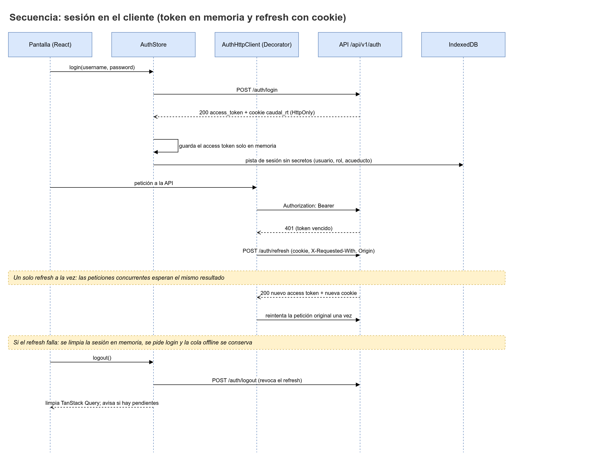
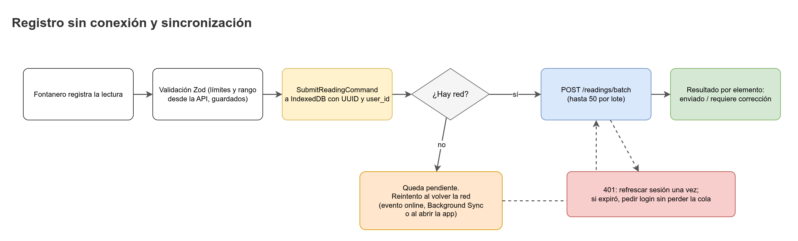

# Integración con la API desde el frontend

Este documento explica cómo `caudal-frontend` consume la API REST de `caudal-backend` (`/api/v1`). Sirve para implementar un hook, un adaptador o un cliente nuevo sin adivinar. Las reglas de seguridad de la sesión y del almacenamiento viven en [`security.md`](security.md).



## 1. Resumen

Ningún componente llama a `fetch` directamente. El flujo es siempre el mismo:

```
componente -> hook (TanStack Query) -> CaudalApi (fachada)
           -> LoggingHttpClient -> RetryHttpClient -> AuthHttpClient
           -> FetchHttpClient -> API (/api/v1)
```

| Pieza | Ruta propuesta | Responsabilidad |
|---|---|---|
| Hooks por pantalla | `src/features/<feature>/` | Consultas y mutaciones con TanStack Query. No conocen HTTP. |
| `CaudalApi` | `src/services/CaudalApi.ts` | Fachada (patrón P10). Expone métodos de negocio y devuelve modelos de vista. |
| `HttpClient` y decoradores | `src/services/http/` | Transporte y decoradores (P09): `AuthHttpClient`, `RetryHttpClient`, `LoggingHttpClient`. |
| `ApiDtoAdapter` | `src/services/adapters/ApiDtoAdapter.ts` | Convierte DTO del servidor en modelo de vista (P06). |
| `OfflineDatabase` | `src/services/OfflineDatabase.ts` | IndexedDB con Dexie (P01) para la cola offline. |
| Textos de error | `src/i18n/es.ts` | Mapa de `code` a texto en español. |
| Tipos del contrato | `src/services/api-schema.d.ts` (ruta por definir) | Generados con openapi-typescript. No se editan a mano. |

Orden de composición (de fuera hacia dentro). Es una decisión de este documento:

```ts
// src/services/http/createHttpClient.ts (propuesta)
const transport: HttpClient = new FetchHttpClient({
  baseUrl: import.meta.env.VITE_API_BASE_URL,
});
const withAuth = new AuthHttpClient(transport, sessionStore);
const withRetry = new RetryHttpClient(withAuth, retryPolicy);
export const httpClient: HttpClient = new LoggingHttpClient(withRetry, logger);

export const caudalApi = new CaudalApi(httpClient);
```

Motivo del orden: `RetryHttpClient` queda fuera de `AuthHttpClient`, así cada intento pasa por la autenticación y usa el token vigente. `LoggingHttpClient` queda al final para registrar el resultado de cada llamada lógica.

## 2. Cliente HTTP

### 2.1 Contrato

```ts
export interface HttpRequest {
  readonly method: 'GET' | 'POST' | 'PATCH' | 'DELETE';
  readonly path: string; // relativo a /api/v1, por ejemplo "/readings"
  readonly query?: Readonly<Record<string, string | number>>;
  readonly headers?: Readonly<Record<string, string>>;
  readonly body?: unknown;
  readonly idempotencyKey?: string; // UUID generado en el cliente
  readonly signal?: AbortSignal;
}

export interface HttpClient {
  send<T>(request: HttpRequest): Promise<T>;
}
```

`FetchHttpClient` es el único decorador que llama a `fetch`. Construye la URL con `VITE_API_BASE_URL` y el prefijo `/api/v1`. Es la única variable de entorno del frontend que se usa para la API (ver [`security.md`](security.md), sección de secretos).

### 2.2 Cabeceras y credenciales

| Elemento | Regla |
|---|---|
| `Accept` | `application/json` en todas las peticiones. |
| `Content-Type` | `application/json` cuando hay cuerpo. |
| `Authorization` | `Bearer <access token>` si hay un token en memoria. Lo agrega solo `AuthHttpClient`. |
| `X-Requested-With` | `caudal-web` en todas las peticiones. El backend la exige en `/auth/refresh`. |
| `Idempotency` | El UUID del cliente va en el campo `id` del cuerpo. No hay cabecera aparte. |
| `credentials` | `include` solo en `/auth/*`. En el resto, `omit`. |

```ts
function credentialsFor(path: string): RequestCredentials {
  return path.startsWith('/auth/') ? 'include' : 'omit';
}
```

Como el frontend (Vercel) y la API (Render) son sitios distintos, la cookie `caudal_rt` usa `SameSite=None` (hechos canónicos, sección 21).

### 2.3 `AuthHttpClient`

Agrega el Bearer y refresca el token una sola vez cuando la API responde `401`. Las peticiones concurrentes que reciben `401` esperan la misma promesa de refresh.

```ts
export class AuthHttpClient implements HttpClient {
  private inFlightRefresh: Promise<void> | null = null;

  constructor(
    private readonly next: HttpClient,
    private readonly session: SessionStore,
  ) {}

  async send<T>(request: HttpRequest): Promise<T> {
    const sentWithToken = this.session.accessToken;
    try {
      return await this.next.send<T>(this.withToken(request));
    } catch (error) {
      if (!isHttpStatus(error, 401) || request.path.startsWith('/auth/refresh')) {
        throw error;
      }
      await this.refreshOnce(sentWithToken);
      return this.next.send<T>(this.withToken(request)); // un solo reintento
    }
  }

  private refreshOnce(sentWithToken: string | null): Promise<void> {
    // Si otra petición ya renovó el token mientras esta esperaba, no se vuelve a refrescar.
    if (this.session.accessToken !== sentWithToken) return Promise.resolve();
    this.inFlightRefresh ??= this.session.refresh().finally(() => {
      this.inFlightRefresh = null;
    });
    return this.inFlightRefresh;
  }

  private withToken(request: HttpRequest): HttpRequest {
    const token = this.session.accessToken;
    return token ? { ...request, headers: { Authorization: `Bearer ${token}` } } : request;
  }
}
```

Reglas:

- `session.refresh()` llama a `POST /auth/refresh` con `credentials: 'include'`. Si falla, borra la sesión en memoria, cierra la sesión local y envía al usuario a la pantalla de acceso.
- Si el reintento también responde `401`, el error sale hacia arriba. No hay un segundo refresh.
- El token nunca se guarda en `localStorage`, `sessionStorage` ni IndexedDB.

### 2.4 `RetryHttpClient`

Reintenta solo peticiones `GET` (idempotentes) y solo ante error de red o `503`. Las mutaciones (`POST`, `PATCH`, `DELETE`) no se reintentan aquí. Su reintento lo hace la cola offline con el mismo UUID de idempotencia.

```ts
export class RetryHttpClient implements HttpClient {
  constructor(
    private readonly next: HttpClient,
    private readonly policy: RetryPolicy,
  ) {}

  async send<T>(request: HttpRequest): Promise<T> {
    if (request.method !== 'GET') return this.next.send<T>(request);

    for (let attempt = 1; ; attempt += 1) {
      try {
        return await this.next.send<T>(request);
      } catch (error) {
        if (!this.policy.shouldRetry(error, attempt)) throw error;
        await delay(this.policy.backoffMs(attempt), request.signal);
      }
    }
  }
}
```

| Parámetro | Valor |
|---|---|
| Métodos reintentables | `GET` |
| Errores reintentables | Error de red (`TypeError` de `fetch`) y `503` (`MODEL_NOT_READY` o caída de servicio) |
| Número de intentos y backoff | Por definir (propuesta: 3 intentos con backoff exponencial y jitter) |
| Respeto de `Retry-After` | Por definir |

### 2.5 `LoggingHttpClient`

Registra método, ruta sin cuerpo, estado, duración y `request_id` (cuando el error lo trae). Nunca registra:

- Cuerpos de petición ni de respuesta.
- Cabeceras `Authorization` y `Cookie`.
- Campos `password`, `token`, `secret`.
- Teléfonos o nombres de personas.

El registro en consola queda activo solo en desarrollo. El destino de logs en producción está por definir.

## 3. Fachada `CaudalApi`

Los hooks llaman a `CaudalApi`, no a `HttpClient`. Cada método recibe datos de negocio y devuelve un modelo de vista.

```ts
export class CaudalApi {
  constructor(private readonly http: HttpClient) {}

  async getTankStatus(tankId: string): Promise<TankStatusView> {
    const dto = await this.http.send<TankStatusDto>({
      method: 'GET',
      path: `/tanks/${encodeURIComponent(tankId)}/status`,
    });
    return ApiDtoAdapter.toTankStatus(dto);
  }
}
```

Reglas de la fachada:

- Los identificadores de ruta se codifican con `encodeURIComponent` y se validan como UUID antes de salir.
- Ningún método devuelve un DTO crudo a la UI.
- Ningún método arma SQL, filtros libres ni campos extra. El backend rechaza campos desconocidos (`FAIL_ON_UNKNOWN_PROPERTIES`), así que el cuerpo se arma campo por campo.
- Los nombres de tipos `TankStatusDto` y similares son alias de los esquemas generados (ver sección 4). El nombre exacto del esquema se toma del OpenAPI.

## 4. Tipos generados con openapi-typescript

Los tipos se generan desde el OpenAPI del backend (`/v3/api-docs`, activo en todos los entornos salvo `API_DOCS_ENABLED=false`).

```bash
pnpm gen:api
```

El script `gen:api` lee la URL del backend, genera el archivo y lo deja en la ruta de salida acordada (por definir). Reglas:

- Si el backend tiene `API_DOCS_ENABLED=false`, el comando falla. Generar contra una instancia de desarrollo o contra un JSON guardado.
- El archivo generado no se edita a mano.
- Propuesta de CI: ejecutar `pnpm gen:api` y comprobar que no hay diferencias (`git diff --exit-code`). Así se detecta la desalineación con el backend.

```ts
import type { components } from './api-schema';

export type ReadingRequest = components['schemas']['CreateReadingRequest']; // nombre verificar
```

## 5. Adaptadores DTO a modelo de vista

Reglas de conversión:

| Dato | Desde el servidor | En la vista |
|---|---|---|
| Fecha y hora | ISO-8601 en UTC (`timestamptz`) | `Date` mostrado en `America/Bogota` |
| Número decimal | Número JSON con punto (`2.1`) | Texto con coma (`2,1`) |
| Texto | Ya validado y en español | Se muestra como texto plano |
| Estatus epistémico | `OBSERVED`, `ESTIMATED`, `INFERRED`, `CONFIRMED` | Etiqueta en español desde i18n |

Formato de fecha y número:

```ts
export const GAUGE_MAX_DECIMALS = 2; // límite de gauge_value en los hechos canónicos

const gaugeFormatter = new Intl.NumberFormat('es-CO', {
  maximumFractionDigits: GAUGE_MAX_DECIMALS,
});

const timeFormatter = new Intl.DateTimeFormat('es-CO', {
  timeZone: 'America/Bogota',
  dateStyle: 'medium',
  timeStyle: 'short',
});

export const formatGauge = (value: number): string => gaugeFormatter.format(value);
export const formatDateTime = (iso: string): string => timeFormatter.format(new Date(iso));
```

Entrada del usuario. La API no convierte tipos (`sin coerción de tipos`), así que la coma se convierte a punto antes de enviar. Esto ocurre en la capa de formulario, no en el adaptador:

```ts
export function parseDecimalInput(raw: string): number {
  const normalized = raw.trim().replace(',', '.');
  const value = Number(normalized);
  if (!/^-?\d+(\.\d{1,2})?$/.test(normalized) || !Number.isFinite(value)) {
    throw new InputFormatError(raw);
  }
  return value;
}
```

Reglas del adaptador:

- Es la única capa que conoce los nombres de los campos del DTO.
- No formatea textos para la UI. El formato de números y fechas se hace con las funciones de arriba.
- Los campos que no se usan en la vista no se copian.

## 6. Formato de error y mapeo a texto

Todas las respuestas de error tienen esta forma:

```json
{
  "error": {
    "code": "GAUGE_OUT_OF_RANGE",
    "message": "La lectura está fuera del rango de la regla del tanque.",
    "details": { "gauge_min": "0,00", "gauge_max": "5,00", "value": "8,00" },
    "request_id": "..."
  }
}
```

`ApiError` concentra la lectura del error:

```ts
export class ApiError extends Error {
  constructor(
    readonly status: number,
    readonly code: string,
    readonly details: Readonly<Record<string, unknown>>,
    readonly requestId: string | undefined,
    serverMessage: string,
  ) {
    super(serverMessage);
    this.name = 'ApiError';
  }
}
```

La UI no muestra `message` del servidor directamente. Muestra el texto de `src/i18n/es.ts` según `code`. El `message` del servidor queda como respaldo solo si no hay clave conocida.

```ts
export function errorText(error: unknown): string {
  if (!(error instanceof ApiError)) return es.errors.UNEXPECTED;
  return es.errors[error.code] ?? error.message;
}
```

Claves en `src/i18n/es.ts` (las claves van en inglés, los textos en español):

```ts
export const es = {
  errors: {
    GAUGE_OUT_OF_RANGE: 'La lectura está fuera del rango de la regla del tanque ({gauge_min} a {gauge_max}).',
    MISSING_TIMESTAMP: 'Falta la fecha y hora de la lectura.',
    FUTURE_TIMESTAMP: 'La fecha de la lectura está en el futuro.',
    TOO_OLD: 'La lectura es demasiado antigua para registrarla.',
    DUPLICATE: 'Ya existe una lectura igual en esa ventana de tiempo.',
    SUDDEN_JUMP: 'El cambio es muy brusco. Se guarda marcada para revisión.',
    STALE: 'El último dato del tanque es viejo.',
    MODEL_NOT_READY: 'El pronóstico no está disponible. Se muestra una estimación simple.',
    UNEXPECTED: 'Ocurrió un error inesperado. Intenta de nuevo.',
  },
} as const;
```

Notas:

- Los códigos de la lista son los de `API.md`, sección 1.4. El catálogo completo está en el OpenAPI y se revisa al generar tipos.
- Los códigos de login (`INVALID_CREDENTIALS`) y de límite de tasa (`RATE_LIMITED`, `429`) están en `API.md`, sección 1.4.
- En errores `5xx` se muestra el `request_id` como código de soporte.
- `details` de validación por campo: `{ "fields": [{ "field", "code" }] }` (`input-validation.md`, sección 2).

## 7. Paginación por cursor

Parámetros: `limit` (entero de 1 a 100, por defecto 20) y `cursor` (cadena opaca firmada por el servidor). Los nombres de los parámetros se confirman en el OpenAPI.

Reglas:

- El frontend nunca interpreta ni construye un cursor. Solo lo reenvía tal como llegó.
- Las listas usan `useInfiniteQuery` de TanStack Query.
- El nombre del campo que trae el siguiente cursor en la respuesta se confirma en OpenAPI (propuesta: `nextCursor`).

```ts
export function useReadings(tankId: string) {
  return useInfiniteQuery({
    queryKey: ['readings', tankId],
    queryFn: ({ pageParam }) =>
      caudalApi.listReadings({ tankId, cursor: pageParam, limit: READINGS_PAGE_SIZE }),
    initialPageParam: undefined as string | undefined,
    getNextPageParam: (lastPage) => lastPage.nextCursor ?? undefined,
  });
}
```

## 8. Idempotencia y cola offline

Cada lectura, corrección o cierre de día recibe un UUID al momento de capturarse (`crypto.randomUUID()`). El backend responde igual si recibe el mismo UUID otra vez, así que un reenvío después de perder la respuesta es seguro.

```ts
export async function submitReading(draft: ReadingDraft): Promise<void> {
  const entry: QueuedReading = {
    ...draft,
    clientId: crypto.randomUUID(),
    queuedAt: new Date().toISOString(),
    attempts: 0,
  };
  await offlineDb.queuedReadings.add(entry);
  void syncQueue.flush();
}
```

Reglas de la cola:

- Se implementa con los comandos `SubmitReadingCommand` y `CloseDayCommand` (P13) en `src/core`, y con `SyncQueueStore` como observable (P17).
- La sincronización usa `POST /readings` para uno y `POST /readings/batch` para varios.
- El tamaño máximo de lote no está definido. Mientras tanto aplica el límite general de 64 KiB del cuerpo JSON (verificar).
- Una entrada se borra de IndexedDB solo cuando el servidor la acepta o el usuario la descarta con motivo.
- Los estados de conexión son `ConnectionState` (En línea, Sin conexión, Sincronizando, P18).
- La cola no guarda tokens ni secretos. Ver [`security.md`](security.md), sección de IndexedDB.

Diagrama del flujo offline: 

## 9. Endpoints que usa cada pantalla

Mapa propuesto. Confirmar contra el mapa de pantallas ([`mapa-de-pantallas.png`](../docs/images/mapa-de-pantallas.png)).

| Feature (`src/features/`) | Módulo | Quién la usa | Endpoints |
|---|---|---|---|
| `auth` | M1 | Todos | `POST /auth/login`, `POST /auth/refresh`, `POST /auth/logout`, `POST /auth/logout-all`, `POST /auth/change-password`, `POST /auth/reset-password`, `GET /auth/me`, `POST /auth/mfa/*` |
| `admin` (usuarios) | M1 | `BOARD_ADMIN` | `GET/POST /users`, `PATCH /users/{id}`, `POST /users/{id}/reset-grants`, `GET/POST/DELETE /memberships` |
| `rules` | M2 | `BOARD_ADMIN`, `BOARD_MEMBER` (crea borrador) | `GET /rule-sets/current`, `GET /rule-sets`, `GET /rule-sets/{id}`, `POST /rule-sets`, `PATCH /rule-sets/{id}`, `POST /rule-sets/{id}/activate`, `GET /catalogs/{catalog}` |
| `rules` (red) | M2 | `BOARD_ADMIN` | `GET/POST /tanks`, `GET/POST /sectors`, `PATCH /sectors/{id}`, `GET/POST /sectors/{id}/valves`, `PATCH /valves/{id}` |
| `readings` | M3 | `OPERATOR`, `BOARD_ADMIN` | `GET /meta/constraints`, `POST /readings`, `POST /readings/batch`, `GET /readings`, `GET /readings/{id}`, `POST /readings/{id}/corrections` |
| `tank-status` | M4 | `OPERATOR`, `BOARD_*`, `PROJECT_TEAM` | `GET /tanks/{id}/status`, `GET /tanks/{id}/forecasts/latest`, `POST /tanks/{id}/forecasts`, `GET /anomalies`, `PATCH /anomalies/{id}` |
| `proposals` | M5, M6 | `BOARD_ADMIN`, `BOARD_MEMBER` | `POST /schedule-proposals`, `GET /schedule-proposals`, `GET /schedule-proposals/{id}`, `POST /schedule-proposals/{id}/approve`, `POST /schedule-proposals/{id}/modify`, `POST /schedule-proposals/{id}/reject`, `POST /schedule-proposals/{id}/publish` |
| `closure` | M8 | `OPERATOR` (cierre), `BOARD_ADMIN` | `POST /schedule-items/{id}/execution`, `GET /days/{date}/closure`, `POST /days/{date}/closure` |
| `incidents` | M7 | `OPERATOR`, `PROJECT_TEAM`, `BOARD_*` | `GET /incidents`, `POST /incidents`, `PATCH /incidents/{id}/status` |
| `public` | M7 | Público sin login (y los roles con acceso al horario publicado) | `GET /public/{aqueductSlug}/schedule`, `GET /public/{aqueductSlug}/schedule/whatsapp-text`, `GET /public/{aqueductSlug}/schedule/poster.pdf`, `POST /public/{aqueductSlug}/damage-reports`, `GET /public/damage-reports/{trackingCode}` |
| `minutes` | M9 | `BOARD_ADMIN`, `BOARD_MEMBER` | `POST /minutes`, `GET /minutes/{id}`, `GET /minutes/{id}/pdf`, `POST /summary-shares`, `DELETE /summary-shares/{id}` |
| `minutes` (entidades) | M9 | `SUPPORT_ENTITY` | `GET /summaries` |
| `evaluation` | M10 | `BOARD_ADMIN`, `PROJECT_TEAM` | `GET /forecast-evaluation` |
| `admin` (auditoría) | M12 | `BOARD_ADMIN`, `PROJECT_TEAM` | `GET /audit-log`, `GET /security-events` |
| `admin` (dispositivos) | M11 | `BOARD_ADMIN`, `PROJECT_TEAM` | `POST /devices`, `POST /devices/{id}/keys`, `POST /valve-commands/manual` |
| `admin` (importación) | M13 | `PROJECT_TEAM` (solo acueducto demo) | `POST /imports/readings`, `POST /imports/shift-executions`, `POST /imports/incidents` |

Notas:

- Las pantallas de `SUPPORT_ENTITY` solo ven `GET /summaries`, y solo lo autorizado y vigente.
- La página pública no envía cookies ni Bearer. Sus rutas están en `/public/*`.
- El pronóstico (`GET /tanks/{id}/forecasts/latest`) puede venir vacío. La UI muestra la estimación simple cuando no hay pronóstico de la IA.
- Los endpoints de salud (`/actuator/health`) no los usa la aplicación.

## 10. Mocks con MSW

Los mocks se escriben con MSW (Mock Service Worker) y se usan en Vitest y en desarrollo sin backend. Reglas:

- Los handlers viven en `src/mocks/handlers/` (propuesta), uno por feature.
- Las respuestas se tipan con los mismos tipos generados que usa la aplicación. Si el contrato cambia, el compilador marca el mock.
- Los datos de prueba se marcan como "Datos simulados" y no contienen nombres ni teléfonos reales.
- Si Playwright usa mocks o un backend real: por definir.

```ts
import { http, HttpResponse } from 'msw';

const API = `${import.meta.env.VITE_API_BASE_URL}/api/v1`;

export const handlers = [
  http.get(`${API}/tanks/:tankId/status`, ({ params }) =>
    HttpResponse.json(tankStatusFixture(String(params.tankId))),
  ),
];
```

Relacionados: [`security.md`](security.md), [`../docs/`](../docs/), [`caudal-backend/docs/Seguridad.md`](https://github.com/NicoalsD/caudal-backend/blob/develop/docs/Seguridad.md), [`caudal-backend/.agents/input-validation.md`](https://github.com/NicoalsD/caudal-backend/blob/develop/.agents/input-validation.md)
