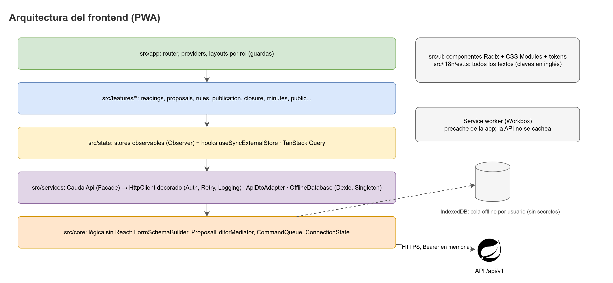

# Arquitectura del frontend

Este documento define cómo se organiza `caudal-frontend`: capas, reglas de dependencia, árbol de carpetas, rutas por rol, manejo de sesión, uso de TanStack Query, formularios generados desde las reglas, y la configuración PWA. Es la referencia para escribir código nuevo. Si una decisión aquí contradice los hechos canónicos, prevalecen los hechos canónicos y este documento se corrige.



La secuencia de la sesión en el cliente (login, refresco, 401 y cierre) está en `../docs/images/secuencia-sesion-cliente.png`.

## 1. Stack en una línea

React 19, Vite, TypeScript estricto, React Router, TanStack Query, React Hook Form con Zod, Dexie (IndexedDB), `vite-plugin-pwa` (Workbox), Radix UI sin estilos, CSS Modules con tokens en variables CSS, Recharts, sonner, lucide-react y openapi-typescript. Detalle completo en `docs/` y en `.agents/design-theme.md`.

## 2. Capas

Las dependencias apuntan hacia adentro: `app → features → state → services → core`. `ui` es una capa lateral que solo presenta.

| Capa | Qué contiene | Qué NO contiene |
|------|--------------|-----------------|
| `src/core` | Lógica pura sin React: builders de esquemas, mediator de propuestas, cola de comandos, máquinas de estado (`ConnectionState`), formato de números con coma decimal, fechas en `America/Bogota`, mapeo de códigos de error a claves i18n, políticas de reintento. | React, DOM, `fetch`, Dexie, `Date.now()` o `Math.random()` directos (se inyectan `Clock` y `IdGenerator`). |
| `src/services` | Cliente HTTP decorado (`HttpClient`), fachada `CaudalApi`, adapters DTO→vista (`ApiDtoAdapter`), `OfflineDatabase` (Dexie), `TokenStore` (access token en memoria), tipos generados de OpenAPI. | Componentes, hooks de React, textos de UI. |
| `src/state` | Stores observables (`SyncQueueStore`, `ConnectivityMonitor`, `SessionStore`) y hooks que los exponen con `useSyncExternalStore`. Puente entre la lógica y React para estado que no vive en el servidor. | Llamadas HTTP directas; lógica de negocio. |
| `src/features/*` | Un módulo por tema funcional: `auth`, `readings`, `tank-status`, `proposals`, `rules`, `publication`, `closure`, `minutes`, `incidents`, `evaluation`, `admin`, `public`. Cada uno tiene páginas, hooks de TanStack Query, formularios y su `queryKeys.ts`. | Acceso a `fetch` o a Dexie; otros features (se comparten por `state`, `core` o `ui`). |
| `src/app` | Router, providers (`QueryClientProvider`, `SessionProvider`, `Toaster`), layouts por rol, guardas de ruta, página 404 y de error global. | Lógica de negocio. |
| `src/ui` | Componentes presentacionales: envoltorios de Radix con estilo del tema, botones, campos, chips de estado, banners (`SimulatedDataBanner`, `SyncStatusBar`), tablas accesibles. Reciben props y emiten eventos. | Hooks de datos, `services`, textos fijos. |
| `src/i18n/es.ts` | Todos los textos visibles, con claves en inglés e interpolación (`"Máximo {max}"`). | Lógica. |

### 2.1 Reglas de dependencia

| Desde | Puede importar | No puede importar |
|-------|----------------|-------------------|
| `core` | nada de este repo (solo tipos propios) | `services`, `state`, `features`, `app`, `ui`, React |
| `services` | `core` | `state`, `features`, `app`, `ui`, React |
| `state` | `core`, `services` | `features`, `app`, `ui` |
| `features` | `core`, `state`, `services` (solo `CaudalApi` y tipos), `ui`, `i18n` | otros `features`, `app` |
| `ui` | `i18n`, `core` (solo utilidades de formato) | `services`, `state`, `features`, `app` |
| `app` | todo lo anterior | nada que lo importe a él |

Se verifica con una regla de ESLint de importaciones restringidas (propuesta: `eslint-plugin-boundaries` o `no-restricted-imports` con patrones por carpeta, por definir). Un import que viola la tabla rompe el lint, no solo la revisión.

Regla adicional: los componentes de `features` no llaman a `fetch`, no leen `localStorage` y no construyen URLs. Todo pasa por `CaudalApi` a través de un hook de TanStack Query.

## 3. Árbol de carpetas propuesto

```
caudal-frontend/
├── .agents/                       # Documentación para agentes y equipo
├── docs/                          # Documentación pública del repo (si aplica)
├── e2e/                           # Playwright: flujos completos
│   └── fixtures/
├── public/
│   ├── icons/                     # 192, 512, maskable, apple-touch
│   └── favicon.svg
├── src/
│   ├── app/
│   │   ├── router.tsx             # createBrowserRouter, rutas por rol
│   │   ├── providers/             # QueryProvider, SessionProvider, ToasterProvider
│   │   ├── guards/                # RequireAuth, RequireRole, RequirePrivacyAccepted
│   │   ├── layouts/               # PublicLayout, OperatorLayout, BoardLayout, TeamLayout, EntityLayout
│   │   └── pages/                 # NotFoundPage, ErrorPage
│   ├── features/
│   │   ├── auth/                  # LoginPage, ChangePasswordPage, useSession, queryKeys.ts
│   │   ├── readings/              # ReadingForm, OutboxPage, hooks, schemas.ts
│   │   ├── tank-status/           # TankStatusPage, ForecastChart (usa ui/chart)
│   │   ├── proposals/             # ProposalListPage, ProposalDetailPage, ProposalEditor
│   │   ├── rules/                 # RuleSetDraftPage, RuleHistoryPage
│   │   ├── publication/           # PublishPage, WhatsAppCopyButton, PosterButton
│   │   ├── closure/               # DayClosurePage
│   │   ├── minutes/
│   │   ├── incidents/
│   │   ├── evaluation/
│   │   ├── admin/                 # Usuarios, membresías, sectores, válvulas, dispositivos, auditoría
│   │   └── public/                # PublicSchedulePage, DamageReportForm, TrackingPage
│   ├── state/
│   │   ├── SyncQueueStore.ts
│   │   ├── ConnectivityMonitor.ts
│   │   ├── SessionStore.ts
│   │   └── hooks/                 # useSyncQueue.ts, useConnectionState.ts, useSession.ts
│   ├── services/
│   │   ├── http/                  # HttpClient.ts, BaseFetchHttpClient.ts, AuthHttpClient.ts, RetryHttpClient.ts, LoggingHttpClient.ts
│   │   ├── api/                   # CaudalApi.ts, endpoints/*.ts, adapters/ApiDtoAdapter.ts
│   │   ├── session/               # TokenStore.ts, SessionRefresher.ts
│   │   ├── offline/               # OfflineDatabase.ts, schema.ts
│   │   └── generated/             # Tipos de openapi-typescript (no se edita a mano)
│   ├── core/
│   │   ├── forms/                 # FormSchemaBuilder.ts
│   │   ├── proposal/              # ProposalEditorMediator.ts
│   │   ├── commands/              # Command.ts, CommandQueue.ts, SubmitReadingCommand.ts, CloseDayCommand.ts
│   │   ├── connection/            # ConnectionState.ts
│   │   ├── format/                # decimal.ts (coma), time.ts (America/Bogota), numbers.ts
│   │   ├── errors/                # ErrorCodeMapper.ts, DomainError.ts
│   │   ├── policy/                # clientPolicy.ts (constantes con nombre y origen)
│   │   └── time/                  # Clock.ts, SystemClock.ts
│   ├── ui/
│   │   ├── primitives/            # Button, Field, Dialog, Tabs, Slider, Tooltip (envoltorios de Radix)
│   │   ├── feedback/              # StatusChip, SyncStatusBar, SimulatedDataBanner, EmptyState, ErrorState
│   │   ├── chart/                 # ChartFrame, AccessibleTable
│   │   └── styles/                # tokens.css, reset.css, typography.css, motion.css
│   ├── i18n/
│   │   └── es.ts                  # Único archivo de textos visibles
│   ├── test/                      # setup de Vitest, MSW handlers, fábricas de datos
│   └── main.tsx
├── .env.example
├── CONTRIBUTING.md
├── vite.config.ts
├── vitest.config.ts
├── vercel.json
└── package.json
```

Las carpetas `services/generated` y `i18n` son las únicas que contienen literales de la API o de texto. Todo lo demás los referencia por nombre.

## 4. Rutas por rol

Las rutas se declaran en `src/app/router.tsx`. Las rutas no declaradas responden 404 (deny by default). Los roles salen de `GET /api/v1/auth/me`.

| Actor | Prefijo | Rutas principales | Guardas |
|-------|---------|-------------------|---------|
| Público (sin login) | `/p/:aqueductSlug` | `/p/:aqueductSlug` (horario por sector), `/p/:aqueductSlug/reportar-dano` (formulario), `/p/seguimiento/:trackingCode` | Ninguna. Solo `PublicLayout`. |
| Sesión (todos) | raíz | `/login`, `/cambiar-contrasena`, `/aviso-de-privacidad` | `RequireAuth` para las dos últimas; `RequirePasswordChanged`, `RequirePrivacyAccepted` según el estado del usuario. |
| Fontanero (`OPERATOR`) | `/operador` | `/operador/inicio`, `/operador/lectura/nueva`, `/operador/pendientes`, `/operador/cierre/:date`, `/operador/dano` | `RequireRole(['OPERATOR'])` |
| Junta (`BOARD_ADMIN`, `BOARD_MEMBER`) | `/junta` | `/junta/tanque`, `/junta/propuestas`, `/junta/propuestas/:id`, `/junta/publicacion`, `/junta/reglas`, `/junta/reglas/:id`, `/junta/reglas/:id/historial`, `/junta/red` (sectores y válvulas), `/junta/actas`, `/junta/incidentes`, `/junta/entidades` | `RequireRole(['BOARD_ADMIN','BOARD_MEMBER'])`. Dentro, las acciones dependen de permisos (ver 4.1). |
| Junta, solo administración | `/junta/usuarios` | `/junta/usuarios` | `RequireRole(['BOARD_ADMIN'])` |
| Equipo (`PROJECT_TEAM`) | `/equipo` | `/equipo/evaluacion`, `/equipo/salud`, `/equipo/dispositivos`, `/equipo/auditoria`, `/equipo/importacion` (solo acueducto demo) | `RequireRole(['PROJECT_TEAM'])`. La importación además exige `aqueduct.isDemo` (por definir el campo). |
| Entidad de apoyo (`SUPPORT_ENTITY`) | `/entidad` | `/entidad/resumenes` | `RequireRole(['SUPPORT_ENTITY'])` |
| Estado compartido | `/tanque` | `/tanque` (estado y pronóstico) | `RequireRole(['OPERATOR','BOARD_ADMIN','BOARD_MEMBER','PROJECT_TEAM'])` |

Las guardas de ruta son de experiencia, no de seguridad. El backend decide por rol, permiso y acueducto (RLS). Una guarda que oculta una ruta no sustituye el 403 de la API, y la UI debe mostrar `ErrorState` si la API responde 403.

### 4.1 Permisos por acción

La matriz de la sección 9 de los hechos canónicos vive en la BD (`iam.role_permissions`). El frontend no hardcodea roles para decidir botones. Usa los códigos de permiso que devuelve `/auth/me` (nombre del campo por definir, verificar en OpenAPI) y un hook `usePermission('PROPOSAL_DECIDE')`. Códigos citados en los hechos: `READING_CREATE`, `RULESET_ACTIVATE`, `PROPOSAL_DECIDE`. Los demás se toman del OpenAPI cuando exista.

### 4.2 Guardas

| Guarda | Qué hace | Si falla |
|--------|----------|----------|
| `RequireAuth` | Exige sesión válida. Si no hay access token, intenta un refresh silencioso una vez. | Redirige a `/login` con `?next=` (solo rutas internas). |
| `RequirePasswordChanged` | Si `/auth/me` indica cambio obligatorio, fuerza `/cambiar-contrasena`. | Redirige. |
| `RequirePrivacyAccepted` | Si hay un aviso de privacidad vigente sin aceptar, muestra `/aviso-de-privacidad`. | Redirige. |
| `RequireRole(roles)` | Compara el rol del usuario con la lista. | Muestra página 403 con `ErrorState` y enlace a su inicio. |

## 5. Sesión

### 5.1 Principios

- El access token (JWT HS256, 15 min) vive solo en memoria, en `TokenStore`. No va en `localStorage`, `sessionStorage` ni IndexedDB.
- El refresh token es opaco y llega en la cookie `caudal_rt` (`HttpOnly; Secure; SameSite=None; Path=/api/v1/auth`, ver `deployment.md`). El JavaScript no lo ve.
- Al recargar la página, la app llama a `POST /api/v1/auth/refresh` para recuperar un access token. Si la cookie falta o expiró, muestra `/login`.
- Cerrar sesión borra el access token de memoria y llama a `POST /api/v1/auth/logout`. Si hay lecturas pendientes, avisa antes (ver `offline-sync.md`).

### 5.2 Componentes

| Pieza | Responsabilidad |
|-------|-----------------|
| `TokenStore` | Guarda `{ accessToken, expiresAt }` en memoria. Métodos `get`, `set`, `clear`. |
| `SessionRefresher` | Un solo refresh en vuelo (single-flight): si varias peticiones reciben 401 a la vez, todas esperan la misma promesa. |
| `AuthHttpClient` | Decorador de `HttpClient`. Añade `Authorization: Bearer`, y ante un 401 intenta refresh una vez y reintenta la petición original. Si el refresh falla, limpia la sesión y emite `SessionExpired`. |
| `SessionStore` | Estado observable: `anonymous`, `authenticated`, `expired`. Lo lee `useSession()`. |
| `BroadcastChannel('caudal-session')` | Propaga el cierre de sesión a otras pestañas (propuesta, verificar soporte en iOS Safari). |

### 5.3 Refresh proactivo

Antes de que expire el access token (propuesta: al 80 % de su vida, 12 min), `SessionRefresher` renueva en segundo plano. La cookie de refresh rota en cada uso (regla de la sección 11 de los hechos), por lo que solo un refresh puede estar en vuelo.

### 5.4 Qué pasa si la sesión expira

1. La petición devuelve 401 y el refresh también falla.
2. `SessionStore` pasa a `expired`. La UI muestra `/login` con el mensaje "Tu sesión venció. Entra de nuevo para continuar."
3. Las lecturas de la cola offline no se borran. Siguen en IndexedDB y se envían al volver a entrar.
4. Tras el login, la cola se reanuda y `TanStack Query` vuelve a la ruta anterior si es interna.

### 5.5 Modo local sin conexión (decisión a validar con Drako)

Sin este modo, un fontanero que recarga la página sin señal no puede registrar una lectura: el access token está solo en memoria y el refresh necesita red.

- Al iniciar sesión con red, `SessionStore` guarda en IndexedDB una **pista de sesión**: `userId`, `role`, `aqueductId`, nombre para mostrar y `expiresAt` del refresh. No contiene tokens, contraseñas ni claves.
- Sin red y sin access token, si hay pista de sesión vigente (propuesta: 30 días para `OPERATOR`, igual que el refresh), `RequireAuth` permite las rutas de `/operador` en modo local. La barra muestra "Sin conexión. Sesión guardada en este celular."
- Las lecturas se encolan con `userId` y `aqueductId` de la pista. El envío exige sesión real (ver `offline-sync.md`, sección 8).
- Las rutas que llaman a la API en vivo (`/junta`, `/equipo`, `/entidad`) no se abren en modo local; muestran el estado sin conexión.
- Cerrar sesión borra la pista. Riesgo a validar: un celular robado podría abrir el formulario y ver el último estado guardado. Por eso el modo local no muestra datos personales ni listas de usuarios.

## 6. TanStack Query

### 6.1 Configuración

- Un `QueryClient` en `src/app/providers/QueryProvider.tsx`.
- `retry`: 1 para queries; 0 para mutaciones (las reintenta la cola offline, no TanStack).
- `refetchOnWindowFocus`: true para estado del tanque y propuestas; false para catálogos.
- `staleTime` por query (valores por definir en `src/core/policy/clientPolicy.ts`). Referencias (`meta/constraints`, `catalogs`) pueden tener `staleTime` largo porque cambian poco; `rule-sets/current` se invalida al activar una versión.

### 6.2 Claves

Cada feature exporta su fábrica de claves en `queryKeys.ts`. Las claves son tuplas con el identificador del acueducto cuando aplica (hay RLS por acueducto).

| Recurso | Clave | Endpoint |
|---------|-------|----------|
| Sesión | `['auth', 'me']` | `GET /auth/me` |
| Restricciones de campos | `['meta', 'constraints']` | `GET /meta/constraints` |
| Reglas vigentes | `['rule-sets', 'current']` | `GET /rule-sets/current` |
| Versiones de reglas | `['rule-sets', 'list']`, `['rule-sets', 'detail', id]` | `GET /rule-sets`, `GET /rule-sets/{id}` |
| Catálogo | `['catalogs', catalogName]` | `GET /catalogs/{catalog}` |
| Estado del tanque | `['tanks', tankId, 'status']` | `GET /tanks/{id}/status` |
| Pronóstico | `['tanks', tankId, 'forecast', 'latest']` | `GET /tanks/{id}/forecasts/latest` |
| Lecturas | `['readings', filters]` | `GET /readings` |
| Propuestas | `['schedule-proposals', 'list', filters]`, `['schedule-proposals', 'detail', id]` | `GET /schedule-proposals`, `GET /schedule-proposals/{id}` |
| Cierre del día | `['days', date, 'closure']` | `GET /days/{date}/closure` |
| Incidentes | `['incidents', filters]` | `GET /incidents` |
| Actas | `['minutes', id]` | `GET /minutes/{id}` |
| Evaluación | `['forecast-evaluation']` | `GET /forecast-evaluation` |
| Público | `['public', slug, 'schedule']` | `GET /public/{slug}/schedule` |
| Seguimiento de daño | `['public', 'damage-report', trackingCode]` | `GET /public/damage-reports/{trackingCode}` |

### 6.3 Invalidación

| Mutación | Claves a invalidar |
|----------|-------------------|
| `POST /readings` o sincronización de la cola | `['readings']`, `['tanks', id, 'status']`, `['tanks', id, 'forecast']` |
| `POST /readings/{id}/corrections` | `['readings']`, `['tanks', id, 'status']`, `['anomalies']` |
| `POST /tanks/{id}/forecasts` | `['tanks', id, 'forecast']`, `['forecast-evaluation']` |
| `POST /schedule-proposals` | `['schedule-proposals', 'list']` |
| `approve`, `modify`, `reject` | `['schedule-proposals', 'detail', id]`, `['schedule-proposals', 'list']` |
| `publish` | lo anterior, `['public']` (todas las claves públicas del acueducto) |
| `POST /days/{date}/closure`, `POST /schedule-items/{id}/execution` | `['days', date, 'closure']`, `['schedule-proposals', 'detail']` |
| `POST /rule-sets/{id}/activate` | `['rule-sets']`, `['meta', 'constraints']` (si cambian límites derivados), `['tanks']`, `['readings']` (los formularios cambian de rango), y reiniciar el `FormSchemaBuilder` |
| `POST /incidents`, `PATCH /incidents/{id}/status` | `['incidents']` |
| `POST /summary-shares`, `DELETE /summary-shares/{id}` | `['summary-shares']` |

Regla: después de una mutación, se invalida la clave más específica y las listas que la contienen. Nunca se usa `invalidateQueries()` sin filtro.

### 6.4 Mutaciones y cola

Las lecturas y el cierre del día no usan `useMutation` directo: pasan por `CommandQueue` (ver `offline-sync.md`). Cuando la cola confirma un envío, emite un evento `SyncCompleted` que el provider traduce en invalidaciones con la tabla anterior. Las aprobaciones y publicaciones sí usan `useMutation`, porque requieren red y no tienen versión offline.

No se hacen actualizaciones optimistas en propuestas: la Junta necesita ver el estado que el servidor confirmó.

## 7. Formularios con Zod armados desde el backend

Los formularios no tienen límites escritos a mano. Las reglas salen del backend en tiempo de ejecución:

- `GET /api/v1/meta/constraints`: límites de `FieldLimits` (mínimos, máximos, patrones y longitudes de nombres, notas, motivos y códigos).
- `GET /api/v1/rule-sets/current`: rango del tanque (`gauge_min`, `gauge_max`), bandas y parámetros que afectan validación en el cliente (por ejemplo, horas máximas por turno si se muestran en pantalla).

### 7.1 Flujo

1. Al arrancar la app, `QueryProvider` precarga `['meta', 'constraints']` y `['rule-sets', 'current']`.
2. Cada respuesta se guarda en `referenceCache` de Dexie (ver `offline-sync.md`), para que el formulario funcione sin red.
3. `FormSchemaBuilder` (patrón P04) recibe ambas respuestas y devuelve un esquema Zod por formulario: `readingFormSchema()`, `reasonSchema()`, `closureSchema()`.
4. El hook `useFormSchema('reading')` devuelve el esquema o `undefined` mientras carga. El formulario muestra el estado de carga; no usa un esquema por defecto.
5. React Hook Form usa `zodResolver(schema)`. Los mensajes salen de `src/i18n/es.ts` con las claves de error (`validation.max`, `validation.decimalPlaces`, etc.) e interpolación.

### 7.2 Forma de la respuesta de `/meta/constraints` (ejemplo, verificar en OpenAPI)

```json
{
  "fields": {
    "reading.note": { "min": 0, "max": 500, "maxLines": 10 },
    "change_reason": { "min": 10, "max": 500 },
    "sector.name": { "min": 2, "max": 60, "pattern": "..." }
  }
}
```

La forma exacta se confirma con el OpenAPI del backend (`/v3/api-docs`). El frontend no inventa claves: si una no existe, el formulario no se arma y se muestra un error de configuración.

### 7.3 Reglas de cambio

- Si la Junta activa una versión nueva, el formulario de lectura usa el nuevo rango después de invalidar `['rule-sets', 'current']`.
- Una lectura ya guardada con el rango anterior no cambia de estado. Una lectura nueva fuera del rango nuevo recibe `422 GAUGE_OUT_OF_RANGE` y queda como `CORRECTION_PENDING`.

## 8. PWA

La PWA usa `vite-plugin-pwa` con Workbox. La estrategia completa de red y caché está en `offline-sync.md`. Resumen de la arquitectura:

| Parte | Decisión |
|-------|----------|
| Precache | HTML, JS, CSS, fuentes autoalojadas, iconos y manifiesto de la app. |
| API privada (`/api/v1/**` con sesión) | `NetworkOnly`. Nunca se cachea. |
| API pública (`/api/v1/public/**`, GET) | `NetworkFirst` con tiempo de espera (propuesta: 3 s) y respaldo en caché (última publicación vista). |
| Referencias (`meta`, `rule-sets`, `catalogs`) | Las guarda la app en Dexie, no el service worker, para tener una sola fuente. |
| Actualización | `registerType: 'prompt'` (propuesta): avisa cuando hay versión nueva y no interrumpe una captura en curso. |
| Persistencia | Pedir `navigator.storage.persist()` al entrar (propuesta). |

## 9. Estructura de una feature

Cada feature sigue el mismo orden de archivos:

```
features/readings/
├── ReadingFormPage.tsx     # Página: compone UI y hooks, sin fetch
├── ReadingForm.tsx         # Presentación del formulario
├── useReadingForm.ts       # React Hook Form + esquema de useFormSchema
├── useCreateReading.ts     # Encola SubmitReadingCommand (no llama a la API)
├── queryKeys.ts
├── schemas.ts              # Solo tipos de vista; los esquemas Zod se construyen en core
└── index.ts                # API pública del feature (lo único que importa app)
```

`index.ts` es la única puerta de entrada. Dentro de `features/readings` no se importa directamente desde `features/proposals`.

## 10. Errores

- El cliente traduce el envelope de la API (`{"error":{"code","message","details","request_id"}}`) a `DomainError` (`code`, `details`, `request_id`).
- `ErrorCodeMapper` (en `core`) convierte `code` en una clave de `es.ts`. Si el código no existe, muestra `errors.generic` y registra el `request_id` en consola de desarrollo.
- El mensaje `message` de la API no se muestra tal cual si hay clave conocida: el texto visible sale de `es.ts`. El `message` sirve de respaldo.
- Los errores de validación `422` con `details` se pintan en el campo indicado.

## 11. Seguridad en el cliente

- React escapa por defecto. Está prohibido `dangerouslySetInnerHTML` (regla de ESLint).
- No se guarda nada sensible en `localStorage`. Las preferencias (por ejemplo, tamaño de texto) sí pueden.
- La cola offline no guarda tokens ni contraseñas.
- CSP estricta según `deployment.md`.

Relacionados: [`design-patterns.md`](design-patterns.md), [`offline-sync.md`](offline-sync.md), [`configuration.md`](configuration.md), [`deployment.md`](deployment.md)
