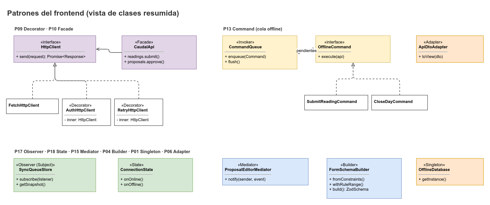

# Patrones de diseño del frontend

Este documento describe los patrones que `caudal-frontend` implementa de forma explícita. Son los identificadores P01 a P18 de los hechos canónicos (sección 16) que tienen dueño en el frontend o son transversales a él. Cada patrón incluye: el problema que resuelve, qué ofrece React o JavaScript de forma nativa, por qué igual se implementa explícito, un esqueleto TypeScript y una prueba.



## Criterios generales

- Los patrones se implementan con clases e interfaces propias, aunque el framework ya ofrezca algo parecido. El objetivo es que el patrón sea visible en el código, probable en pruebas unitarias y reemplazable.
- Las clases de `src/core` no importan React. Los hooks solo adaptan esas clases a React.
- Todo número literal se declara como constante con nombre. El lint `no-magic-numbers` lo exige.
- Los identificadores, comentarios y nombres de prueba van en inglés.

## Tabla de patrones

| ID | Patrón | Clase o módulo | Capa | Dueño |
|----|--------|----------------|------|-------|
| P01 | Singleton | `OfflineDatabase` | `services/offline` | NicoalsD |
| P04 | Builder | `FormSchemaBuilder` | `core/forms` | NicoalsD |
| P06 | Adapter | `ApiDtoAdapter` | `services/api/adapters` | NicoalsD |
| P09 | Decorator | `HttpClient`, `AuthHttpClient`, `RetryHttpClient`, `LoggingHttpClient` | `services/http` | NicoalsD (en el frontend) |
| P10 | Facade | `CaudalApi` | `services/api` | Drako / NicoalsD |
| P13 | Command | `Command`, `SubmitReadingCommand`, `CloseDayCommand`, `CommandQueue` | `core/commands` | NicoalsD |
| P15 | Mediator | `ProposalEditorMediator` | `core/proposal` | NicoalsD |
| P17 | Observer | `SyncQueueStore`, `ConnectivityMonitor` | `state` | NicoalsD |
| P18 | State | `ConnectionState` | `core/connection` | NicoalsD |

---

## P01 Singleton: `OfflineDatabase`

**Problema.** Dexie abre una conexión a IndexedDB por nombre de base. Si cada componente abre la suya, hay bloqueos de versión, transacciones que no se ven entre sí y errores de `VersionError` al actualizar el esquema.

**Qué ofrece el nativo.** Los módulos de ES son singletons por grafo de módulos: un `export const db = new Dexie(...)` se evalúa una vez. React Context también puede compartir una instancia.

**Por qué se implementa explícito.** El módulo es un singleton de carga, no de construcción: no se puede reemplazar en pruebas ni reinicializar tras un cambio de esquema o de usuario. La clase expone una fábrica para tests (`OfflineDatabase.create(name)`) y un punto único para cerrar la conexión en logout.

```ts
// src/services/offline/OfflineDatabase.ts
import Dexie, { type Table } from 'dexie';
import type { OutboxRecord, ReferenceRecord, SessionHintRecord, TankSnapshotRecord } from './schema';

export const OFFLINE_DB_NAME = 'caudal-offline';
export const OFFLINE_DB_VERSION = 1;

export class OfflineDatabase extends Dexie {
  private static instance: OfflineDatabase | undefined;

  readonly outbox!: Table<OutboxRecord, string>;
  readonly referenceCache!: Table<ReferenceRecord, string>;
  readonly tankSnapshots!: Table<TankSnapshotRecord, string>;
  readonly sessionHints!: Table<SessionHintRecord, string>;

  private constructor(name: string) {
    super(name);
    this.version(OFFLINE_DB_VERSION).stores({
      outbox: 'clientId, kind, status, userId, aqueductId, createdAt',
      referenceCache: 'key',
      tankSnapshots: 'tankId',
      sessionHints: 'key',
    });
  }

  static get default(): OfflineDatabase {
    if (!OfflineDatabase.instance) {
      OfflineDatabase.instance = new OfflineDatabase(OFFLINE_DB_NAME);
    }
    return OfflineDatabase.instance;
  }

  /** Test factory: returns a new, isolated instance. Never used in app code. */
  static create(name: string): OfflineDatabase {
    return new OfflineDatabase(name);
  }

  /** Called on logout after the outbox is empty or the user confirmed a wipe. */
  static async resetDefault(): Promise<void> {
    if (OfflineDatabase.instance) {
      OfflineDatabase.instance.close();
      OfflineDatabase.instance = undefined;
    }
  }
}
```

**Prueba.** `OfflineDatabase.create` con `fake-indexeddb` (propuesta, verificar). Casos: dos instancias con el mismo nombre comparten datos; `default` devuelve siempre la misma referencia; `resetDefault` cierra la conexión y la siguiente llamada abre una nueva.

---

## P04 Builder: `FormSchemaBuilder`

**Problema.** Los esquemas de los formularios se construyen con límites que llegan del backend (`/meta/constraints`) y reglas de `/rule-sets/current`. Armarlos a mano en cada formulario duplica reglas y mezcla mensajes con validación.

**Qué ofrece el nativo.** Zod ya es un constructor de esquemas encadenado (`z.string().min(...)`), y React Hook Form acepta cualquier resolver.

**Por qué se implementa explícito.** `FormSchemaBuilder` convierte el contrato del backend (nombres de campo, `min`, `max`, `pattern`) en reglas Zod y en claves de mensaje. Así el resto del frontend no conoce la forma del JSON de restricciones, y el parseo de decimales con coma vive en un solo lugar.

```ts
// src/core/forms/FormSchemaBuilder.ts
import { z, type ZodTypeAny } from 'zod';

export interface FieldConstraint {
  readonly min?: number;
  readonly max?: number;
  readonly pattern?: string;
  readonly maxLines?: number;
}

export type ConstraintsMap = Readonly<Record<string, FieldConstraint>>;

export class FormSchemaBuilder {
  private readonly shape: Record<string, ZodTypeAny> = {};

  constructor(private readonly constraints: ConstraintsMap) {}

  text(field: string): this {
    const c = this.require(field);
    let schema = z.string().trim();
    if (c.min !== undefined) schema = schema.min(c.min, { message: 'validation.min' });
    if (c.max !== undefined) schema = schema.max(c.max, { message: 'validation.max' });
    if (c.pattern !== undefined) {
      schema = schema.regex(new RegExp(c.pattern, 'u'), { message: 'validation.pattern' });
    }
    this.shape[field] = schema;
    return this;
  }

  /** Accepts "2,1" and "2.1"; the output is a JS number with at most `decimals` places. */
  decimal(field: string, minValue: number, maxValue: number, decimals: number): this {
    this.shape[field] = z
      .string()
      .transform((raw, ctx) => {
        const normalized = raw.trim().replace(',', '.');
        const parsed = Number(normalized);
        if (normalized === '' || !Number.isFinite(parsed)) {
          ctx.addIssue({ code: 'custom', message: 'validation.number' });
          return z.NEVER;
        }
        return parsed;
      })
      .pipe(
        z
          .number()
          .min(minValue, { message: 'validation.rangeMin' })
          .max(maxValue, { message: 'validation.rangeMax' })
          .refine((value) => countDecimals(value) <= decimals, {
            message: 'validation.decimalPlaces',
          }),
      );
    return this;
  }

  /** Motivo obligatorio con el rango que el backend define para `change_reason`. */
  requiredReason(field: string): this {
    return this.text(field);
  }

  build(): z.ZodObject<Record<string, ZodTypeAny>> {
    return z.object(this.shape);
  }

  private require(field: string): FieldConstraint {
    const c = this.constraints[field];
    if (!c) {
      throw new Error(`Missing constraint for field "${field}"`);
    }
    return c;
  }
}

function countDecimals(value: number): number {
  const [, fraction = ''] = value.toString().split('.');
  return fraction.length;
}
```

Nota: `requiredReason` es un alias de `text` mientras el backend exprese el motivo con `min` y `max`. Si cambia la regla, se implementa aquí y en un solo lugar.

Uso:

```ts
const schema = new FormSchemaBuilder(constraints)
  .decimal('gauge_value', gaugeMin, gaugeMax, 2)
  .text('note')
  .build();
```

`gaugeMin` y `gaugeMax` salen de la regla vigente (no de constantes). El formato de los mensajes lo resuelve `es.ts` con interpolación (`{min}`, `{max}`).

**Prueba.** Casos: `"2,1"` y `"2.1"` producen el mismo número; `"8"` con máximo 5 produce `validation.rangeMax`; `"2,123"` con dos decimales produce `validation.decimalPlaces`; campo ausente en el mapa lanza error; cadena vacía produce `validation.number`.

---

## P06 Adapter: `ApiDtoAdapter`

**Problema.** La API devuelve JSON con nombres de campo del backend (`snake_case`), fechas en ISO con zona y números que pueden venir como texto. Los componentes necesitan modelos de vista (`camelCase`, `Date`, número para cálculos, texto con coma para mostrar).

**Qué ofrece el nativo.** TypeScript permite tipar el JSON con `as`, y Zod puede parsear y transformar.

**Por qué se implementa explícito.** Un `as` no valida nada y deja pasar cambios del backend. El adapter aísla el contrato: si el backend renombra un campo, cambia un archivo. Los tipos generados por `openapi-typescript` son la entrada; el adapter produce modelos de vista.

```ts
// src/services/api/adapters/ApiDtoAdapter.ts
import type { components } from '../../generated/openapi';
import { formatDecimal } from '../../../core/format/decimal';

type TankStatusDto = components['schemas']['TankStatusResponse'];

export interface TankStatusView {
  readonly tankId: string;
  readonly lastLevel: number;
  readonly lastLevelText: string;
  readonly hoursSinceReading: number;
  readonly trend: 'UP' | 'DOWN' | 'FLAT';
  readonly observedAt: Date;
}

export class ApiDtoAdapter {
  constructor(private readonly locale: string = 'es-CO') {}

  toTankStatus(dto: TankStatusDto): TankStatusView {
    return {
      tankId: dto.tank_id,
      lastLevel: dto.last_gauge_value,
      lastLevelText: formatDecimal(dto.last_gauge_value, this.locale),
      hoursSinceReading: dto.hours_since_reading,
      trend: dto.trend,
      observedAt: new Date(dto.observed_at),
    };
  }
}
```

Los nombres exactos de los campos del DTO se confirman con el OpenAPI. Los del ejemplo son ilustrativos.

**Prueba.** Con un DTO fijo, el adapter devuelve `lastLevelText` `"2,1"` para `2.1`, convierte `observed_at` a `Date`, y falla con error de tipo si falta un campo obligatorio (el test de tipos lo detecta en compilación).

---

## P09 Decorator: `HttpClient` y decoradores

**Problema.** Cada petición necesita autenticación, reintentos para fallas de red, y registro sin datos sensibles. Repetir esa lógica en cada llamada es frágil.

**Qué ofrece el nativo.** `fetch` no tiene interceptores. TanStack Query tiene `retry` por consulta. Un `Proxy` podría envolver el cliente, pero oculta el flujo.

**Por qué se implementa explícito.** Cada responsabilidad es una clase que implementa la misma interfaz y envuelve a otra. El orden importa y debe ser explícito:

```
LoggingHttpClient
  └─ RetryHttpClient
       └─ AuthHttpClient
            └─ BaseFetchHttpClient  (fetch real)
```

- `LoggingHttpClient` es el más externo: registra el resultado final, no cada reintento, y redacta `Authorization`, `Cookie`, `password`, `token`.
- `RetryHttpClient` reintenta solo fallas de red y 5xx, y solo métodos idempotentes (GET) o peticiones con `clientId` (lecturas). No reintenta 401 ni 403 ni 422.
- `AuthHttpClient` está dentro del reintento: si el reintento vuelve a llamarlo, obtiene el token nuevo.

```ts
// src/services/http/HttpClient.ts
export interface HttpRequest {
  readonly method: 'GET' | 'POST' | 'PATCH' | 'DELETE';
  readonly path: string;
  readonly body?: unknown;
  readonly idempotencyKey?: string;
  readonly signal?: AbortSignal;
}

export interface HttpResponse<T> {
  readonly status: number;
  readonly body: T;
  readonly requestId: string | null;
}

export interface HttpClient {
  request<T>(req: HttpRequest): Promise<HttpResponse<T>>;
}
```

```ts
// src/services/http/RetryHttpClient.ts
import type { HttpClient, HttpRequest, HttpResponse } from './HttpClient';
import { NetworkError } from './errors';

export interface RetryPolicy {
  readonly maxAttempts: number;
  readonly baseDelayMs: number;
  delayFor(attempt: number): number;
}

export class RetryHttpClient implements HttpClient {
  constructor(
    private readonly inner: HttpClient,
    private readonly policy: RetryPolicy,
    private readonly sleep: (ms: number) => Promise<void> = (ms) =>
      new Promise((resolve) => setTimeout(resolve, ms)),
  ) {}

  async request<T>(req: HttpRequest): Promise<HttpResponse<T>> {
    let attempt = 0;
    for (;;) {
      attempt += 1;
      try {
        return await this.inner.request<T>(req);
      } catch (error) {
        const retryable = error instanceof NetworkError || isServerError(error);
        const canRetry = retryable && isIdempotent(req) && attempt < this.policy.maxAttempts;
        if (!canRetry) throw error;
        await this.sleep(this.policy.delayFor(attempt));
      }
    }
  }
}

function isIdempotent(req: HttpRequest): boolean {
  return req.method === 'GET' || req.idempotencyKey !== undefined;
}

function isServerError(error: unknown): boolean {
  return error instanceof Error && 'status' in error && (error as { status: number }).status >= 500;
}
```

`AuthHttpClient` y `LoggingHttpClient` siguen la misma forma: reciben `inner: HttpClient` en el constructor. `AuthHttpClient` usa `SessionRefresher` (ver `architecture.md`, sección 5) y ante un 401 llama `refresh()` una vez y repite la petición. `LoggingHttpClient` recibe un `Logger` inyectado.

**Prueba.** Con un `HttpClient` falso: un GET que falla con red dos veces y luego responde, devuelve la respuesta y hace tres llamadas; un POST sin `idempotencyKey` que falla no se reintenta; un 422 no se reintenta; `AuthHttpClient` ante 401 llama refresh una sola vez aunque dos peticiones fallen a la vez.

---

## P10 Facade: `CaudalApi`

**Problema.** La UI no debe conocer las rutas, los DTO ni el orden de los decoradores. Sin una fachada, cada hook repite `httpClient.request` con rutas y adapters.

**Qué ofrece el nativo.** Un objeto literal con funciones exportadas hace lo mismo sin clase.

**Por qué se implementa explícito.** La fachada define el contrato que usa `features`: nombres de métodos del dominio, tipos de vista y un único lugar para cambiar una ruta. Facilita pruebas con MSW y con un falso en memoria.

```ts
// src/services/api/CaudalApi.ts
export class CaudalApi {
  readonly readings: ReadingsApi;
  readonly tanks: TanksApi;
  readonly proposals: ProposalsApi;
  readonly rules: RulesApi;
  readonly publication: PublicationApi;

  constructor(http: HttpClient, adapter: ApiDtoAdapter) {
    this.readings = new ReadingsApi(http, adapter);
    this.tanks = new TanksApi(http, adapter);
    this.proposals = new ProposalsApi(http, adapter);
    this.rules = new RulesApi(http, adapter);
    this.publication = new PublicationApi(http, adapter);
  }
}

// Uso desde features (no desde componentes):
// const status = await api.tanks.status(tankId);
// await api.proposals.approve(id);
```

Cada subclase (`ReadingsApi`, etc.) está en `services/api/endpoints/`, tiene métodos como `submitBatch(items)` y `status(tankId)`, y devuelve modelos de vista.

**Prueba.** Con MSW, cada método de la fachada se prueba contra el contrato de `docs/API.md` del backend (ver `testing-plan.md`). Con un `HttpClient` falso, se verifica el método HTTP y la ruta de cada llamada.

---

## P13 Command: cola offline

**Problema.** Una lectura se captura sin red. Hay que guardarla, enviarla más tarde, reintentar si falla y no duplicarla si la respuesta se pierde.

**Qué ofrece el nativo.** Nada en React: `useReducer` guarda estado, pero no persiste ni reintenta. Las Background Sync API existen en Chromium, pero no en iOS Safari, y no pueden usar el token en memoria.

**Por qué se implementa explícito.** Un comando es un objeto con identidad (`clientId`), tipo (`kind`) y una acción `execute`. Como IndexedDB solo guarda datos planos, el comando se persiste como registro (`OutboxRecord`) y una tabla de ejecutores (`CommandRegistry`) lo reconstruye por `kind`. Sin esta separación, el prototipo de la clase se pierde al guardar.

```ts
// src/core/commands/Command.ts
export type CommandKind = 'SUBMIT_READING' | 'CLOSE_DAY';

export interface CommandContext {
  readonly api: CaudalApiPort;   // interfaz mínima, no la clase concreta
}

export type CommandResult =
  | { readonly outcome: 'SENT'; readonly serverId: string; readonly status: 'ACCEPTED' | 'FLAGGED' }
  | { readonly outcome: 'CORRECTION_PENDING'; readonly code: string; readonly message: string }
  | { readonly outcome: 'RETRY'; readonly reason: 'NETWORK' | 'SERVER' };

export interface Command<P> {
  readonly clientId: string;          // UUID generado al crear, antes de encolar
  readonly kind: CommandKind;
  readonly payload: P;
  readonly createdAt: string;         // ISO-8601 con zona
  execute(context: CommandContext): Promise<CommandResult>;
}
```

```ts
// src/core/commands/SubmitReadingCommand.ts
export interface SubmitReadingPayload {
  readonly tankId: string;
  readonly observedAt: string;        // ISO-8601, hora del celular
  readonly gaugeValue: number;        // ya parseado por FormSchemaBuilder
  readonly waterAppearance: 'NORMAL' | 'MUDDY' | 'TURBID';
  readonly damageReported: boolean;
  readonly note: string;
  readonly ruleSetVersionId: string;  // versión con la que se capturó
}

export class SubmitReadingCommand implements Command<SubmitReadingPayload> {
  readonly kind = 'SUBMIT_READING' as const;

  constructor(
    readonly clientId: string,
    readonly payload: SubmitReadingPayload,
    readonly createdAt: string,
  ) {}

  async execute(context: CommandContext): Promise<CommandResult> {
    return context.api.submitReadingsBatch([{ clientId: this.clientId, ...this.payload }]);
  }
}
```

```ts
// src/core/commands/CommandQueue.ts
export interface OutboxStorePort {
  put(record: OutboxRecord): Promise<void>;
  nextDue(now: Date, limit: number): Promise<readonly OutboxRecord[]>;
  update(clientId: string, patch: Partial<OutboxRecord>): Promise<void>;
}

export class CommandQueue {
  constructor(
    private readonly store: OutboxStorePort,
    private readonly registry: CommandRegistry,
    private readonly clock: Clock,
    private readonly backoff: BackoffPolicy,
  ) {}

  async enqueue(command: Command<unknown>): Promise<void> {
    await this.store.put(toRecord(command, this.clock.now()));
  }

  /** Sends a bounded batch of due items; returns how many reached a final state. */
  async flush(context: CommandContext): Promise<number> {
    // Implementation detail: see offline-sync.md, sections 4 to 7.
    throw new Error('not implemented in this document');
  }
}
```

Los detalles de estados, reintentos y lotes están en `offline-sync.md`. La clase `CommandRegistry` mapea `kind` a un constructor que recibe el `payload` del registro.

**Prueba.** Un comando con el mismo `clientId` encolado dos veces se envía una sola vez (idempotencia); un `RETRY` por red deja el registro en `PENDING` con `attempts + 1`; `CORRECTION_PENDING` no se reintenta; un registro persistido y leído de nuevo se reconstruye con el mismo `kind` y `payload`.

---

## P15 Mediator: `ProposalEditorMediator`

**Problema.** Al editar una propuesta de turnos, cambian a la vez las horas por sector, el total de horas, el motivo y el estado del botón "Guardar cambios". Si cada control valida por su cuenta, las reglas se contradicen (por ejemplo, el total pasa de las horas disponibles mientras el motivo sigue vacío).

**Qué ofrece el nativo.** React pasa estado con props y `useState`. Puede coordinarse con un componente padre, pero la lógica queda dispersa entre componentes.

**Por qué se implementa explícito.** El mediador concentra las reglas de la edición en `core`, sin React. Los controles no se hablan entre sí: notifican al mediador y se suscriben a su estado derivado.

```ts
// src/core/proposal/ProposalEditorMediator.ts
export interface ShiftDraft {
  readonly sectorId: string;
  readonly hours: number;
}

export interface EditorLimits {
  readonly availableHours: number;     // horas disponibles hoy (de la propuesta)
  readonly minShiftHours: number;      // de las reglas
  readonly maxShiftHours: number;      // de las reglas
  readonly reasonMin: number;          // de /meta/constraints (change_reason)
  readonly reasonMax: number;
}

export interface EditorState {
  readonly shifts: readonly ShiftDraft[];
  readonly totalHours: number;
  readonly reason: string;
  readonly errors: readonly EditorErrorCode[];
  readonly canSubmit: boolean;
  readonly changed: boolean;
}

export type EditorErrorCode =
  | 'TOTAL_EXCEEDS_AVAILABLE'
  | 'SHIFT_BELOW_MIN'
  | 'SHIFT_ABOVE_MAX'
  | 'REASON_REQUIRED'
  | 'REASON_LENGTH';

export type EditorListener = (state: EditorState) => void;

export class ProposalEditorMediator {
  private shifts: ShiftDraft[];
  private reason = '';
  private readonly listeners = new Set<EditorListener>();

  constructor(
    initialShifts: readonly ShiftDraft[],
    private readonly original: readonly ShiftDraft[],
    private readonly limits: EditorLimits,
  ) {
    this.shifts = [...initialShifts];
  }

  setHours(sectorId: string, hours: number): void {
    this.shifts = this.shifts.map((s) => (s.sectorId === sectorId ? { ...s, hours } : s));
    this.emit();
  }

  setReason(reason: string): void {
    this.reason = reason;
    this.emit();
  }

  subscribe(listener: EditorListener): () => void {
    this.listeners.add(listener);
    listener(this.snapshot());
    return () => this.listeners.delete(listener);
  }

  snapshot(): EditorState {
    const totalHours = this.shifts.reduce((sum, s) => sum + s.hours, 0);
    const changed = !sameShifts(this.shifts, this.original);
    const errors = this.collectErrors(totalHours, changed);
    return {
      shifts: this.shifts,
      totalHours,
      reason: this.reason,
      errors,
      changed,
      canSubmit: changed ? errors.length === 0 : false,
    };
  }

  private collectErrors(total: number, changed: boolean): EditorErrorCode[] {
    const errors: EditorErrorCode[] = [];
    if (total > this.limits.availableHours) errors.push('TOTAL_EXCEEDS_AVAILABLE');
    for (const s of this.shifts) {
      if (s.hours < this.limits.minShiftHours) errors.push('SHIFT_BELOW_MIN');
      if (s.hours > this.limits.maxShiftHours) errors.push('SHIFT_ABOVE_MAX');
    }
    if (changed) {
      const length = this.reason.trim().length;
      if (length === 0) errors.push('REASON_REQUIRED');
      else if (length < this.limits.reasonMin || length > this.limits.reasonMax) {
        errors.push('REASON_LENGTH');
      }
    }
    return [...new Set(errors)];
  }

  private emit(): void {
    const state = this.snapshot();
    this.listeners.forEach((listener) => listener(state));
  }
}

function sameShifts(a: readonly ShiftDraft[], b: readonly ShiftDraft[]): boolean {
  return a.length === b.length && a.every((s, i) => s.sectorId === b[i]?.sectorId && s.hours === b[i]?.hours);
}
```

La validación final la repite el backend (propuesta con motivo de 10 a 500 caracteres). El mediador evita enviar una petición que se sabe inválida, no reemplaza la validación del servidor.

**Prueba.** Con las horas superiores al total disponible, `canSubmit` es `false`; cambiar horas sin motivo deja `REASON_REQUIRED`; un motivo de 9 caracteres deja `REASON_LENGTH`; si no hay cambios, `canSubmit` es `false` aunque el motivo esté vacío.

---

## P17 Observer: `SyncQueueStore` y `ConnectivityMonitor`

**Problema.** El encabezado "Pendientes: 3" y la barra de sincronización deben actualizarse cuando cambia la cola, cuando vuelve la red o cuando termina un envío, sin que cada componente consulte IndexedDB.

**Qué ofrece el nativo.** `EventTarget` (y `window.addEventListener('online')`) es el mecanismo nativo de eventos. `useSyncExternalStore` (React 18+) suscribe un componente a una fuente externa.

**Por qué se implementa explícito.** `EventTarget` no tipa los eventos ni define un estado consultable. `SyncQueueStore` define un `getSnapshot` estable y notifica a sus suscriptores; `ConnectivityMonitor` combina `online` y `offline` del navegador con una confirmación real contra la API (`navigator.onLine` no basta, porque puede ser true con una red sin salida).

```ts
// src/state/SyncQueueStore.ts
export type QueueSnapshot = {
  readonly pending: number;
  readonly sending: number;
  readonly needsCorrection: number;
  readonly rejected: number;
  readonly version: number;            // cambia en cada modificación
};

export type QueueListener = () => void;

export class SyncQueueStore {
  private snapshot: QueueSnapshot = emptySnapshot();
  private readonly listeners = new Set<QueueListener>();

  subscribe = (listener: QueueListener): (() => void) => {
    this.listeners.add(listener);
    return () => {
      this.listeners.delete(listener);
    };
  };

  // Stable reference between changes: required by useSyncExternalStore.
  getSnapshot = (): QueueSnapshot => this.snapshot;

  publish(next: Omit<QueueSnapshot, 'version'>): void {
    this.snapshot = { ...next, version: this.snapshot.version + 1 };
    this.listeners.forEach((listener) => listener());
  }
}

function emptySnapshot(): QueueSnapshot {
  return { pending: 0, sending: 0, needsCorrection: 0, rejected: 0, version: 0 };
}
```

```ts
// src/state/ConnectivityMonitor.ts
export class ConnectivityMonitor {
  private online: boolean;
  private readonly listeners = new Set<() => void>();

  constructor(
    private readonly target: EventTarget,
    private readonly probe: () => Promise<boolean>,   // GET de salud a la API
    initialOnline: boolean,
  ) {
    this.online = initialOnline;
    this.target.addEventListener('online', () => void this.check());
    this.target.addEventListener('offline', () => this.set(false));
  }

  subscribe = (listener: () => void): (() => void) => {
    this.listeners.add(listener);
    return () => {
      this.listeners.delete(listener);
    };
  };

  getSnapshot = (): boolean => this.online;

  async check(): Promise<void> {
    this.set(await this.probe());
  }

  private set(value: boolean): void {
    if (this.online === value) return;
    this.online = value;
    this.listeners.forEach((listener) => listener());
  }
}
```

```ts
// src/state/hooks/useSyncQueue.ts
import { useSyncExternalStore } from 'react';

export function useSyncQueue(store: SyncQueueStore): QueueSnapshot {
  return useSyncExternalStore(store.subscribe, store.getSnapshot);
}
```

**Prueba.** Un suscriptor recibe una notificación por cada `publish`; `getSnapshot` devuelve la misma referencia si no hubo cambios; `ConnectivityMonitor` pasa a `true` solo cuando la prueba responde, aunque el evento `online` se dispare; el hook se renderiza de nuevo con `renderHook` de Testing Library.

---

## P18 State: `ConnectionState`

**Problema.** La app tiene tres situaciones de conexión que cambian la forma de la pantalla: en línea, sin conexión y sincronizando. Mezclar booleanos (`online`, `syncing`) produce combinaciones imposibles.

**Qué ofrece el nativo.** Una unión discriminada de TypeScript con `switch` exhaustivo sirve para modelar estados. Es la forma más simple y puede bastar.

**Por qué se implementa explícito.** Aquí se usa una clase con transiciones explícitas porque las transiciones tienen efectos (iniciar un envío, mostrar el aviso de sesión) y deben probarse. Cada estado sabe qué eventos acepta; los demás se ignoran y se registran.

```ts
// src/core/connection/ConnectionState.ts
export type ConnectionEvent =
  | { readonly type: 'PROBE_OK' }
  | { readonly type: 'PROBE_FAILED' }
  | { readonly type: 'SYNC_STARTED' }
  | { readonly type: 'SYNC_FINISHED'; readonly remaining: number }
  | { readonly type: 'AUTH_LOST' };

export interface ConnectionState {
  readonly name: 'ONLINE' | 'OFFLINE' | 'SYNCING' | 'AUTH_REQUIRED';
  next(event: ConnectionEvent): ConnectionState;
}

export class OnlineState implements ConnectionState {
  readonly name = 'ONLINE' as const;
  next(event: ConnectionEvent): ConnectionState {
    switch (event.type) {
      case 'PROBE_FAILED': return new OfflineState();
      case 'SYNC_STARTED': return new SyncingState();
      case 'AUTH_LOST': return new AuthRequiredState();
      default: return this;
    }
  }
}

export class OfflineState implements ConnectionState {
  readonly name = 'OFFLINE' as const;
  next(event: ConnectionEvent): ConnectionState {
    if (event.type === 'PROBE_OK') return new SyncingState();
    return this;
  }
}

export class SyncingState implements ConnectionState {
  readonly name = 'SYNCING' as const;
  next(event: ConnectionEvent): ConnectionState {
    switch (event.type) {
      case 'SYNC_FINISHED': return new OnlineState();
      case 'PROBE_FAILED': return new OfflineState();
      case 'AUTH_LOST': return new AuthRequiredState();
      default: return this;
    }
  }
}

export class AuthRequiredState implements ConnectionState {
  readonly name = 'AUTH_REQUIRED' as const;
  next(event: ConnectionEvent): ConnectionState {
    return event.type === 'PROBE_OK' ? new OnlineState() : this;
  }
}
```

Nota: `SYNC_FINISHED` con `remaining > 0` no cambia de estado; la cola sigue sincronizando en otro lote. El estado se cierra cuando la cola queda vacía o sin elementos enviables (propuesta).

**Prueba.** Tabla de transiciones: cada par (estado, evento) con su resultado esperado; `AUTH_REQUIRED` ignora `PROBE_FAILED`; `OFFLINE` ignora `SYNC_FINISHED`. Cada estado tiene una etiqueta en `es.ts` (`connection.online`, `connection.offline`, `connection.syncing`, `connection.authRequired`).

---

## Dónde se ven los patrones en pantalla

| Patrón | Pantalla que lo muestra |
|--------|-------------------------|
| P13, P17, P18 | Barra de estado de sincronización y pantalla de pendientes (`S09` en `screens.md`). |
| P04 | Formulario de registro de lectura (`P08`). |
| P15 | Editor de propuesta con motivo (`P14`). |
| P10, P06 | Todas las pantallas con datos del servidor. |

## Lo que no se implementa

- Strategy, Factory y Template Method del backend no tienen equivalente en el frontend en esta versión. Si aparece un caso real, se documenta antes de implementarlo.
- P07 Bridge (canales de publicación) vive en el backend. El frontend solo consume el resultado (`PublicationApi.whatsappText`, `PublicationApi.posterPdf`).

Relacionados: [`architecture.md`](architecture.md), [`offline-sync.md`](offline-sync.md), [`testing-plan.md`](testing-plan.md), [`screens.md`](screens.md)
