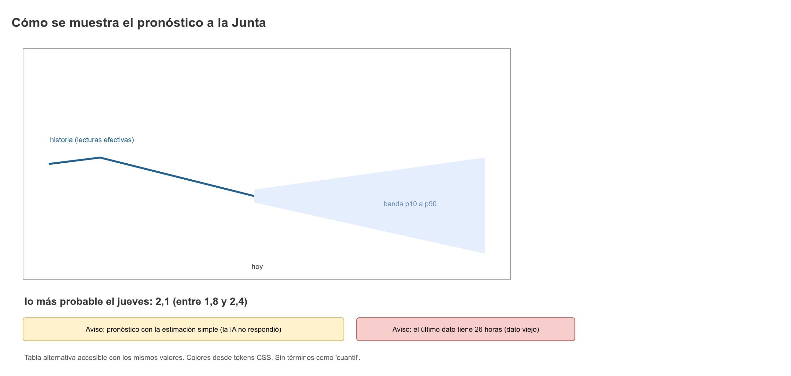

# Visualización del pronóstico para la Junta

El pronóstico del nivel del tanque es lo que más decisiones mueve: cuánta agua hay para repartir y cuándo. Este documento define cómo se muestra a la Junta con Recharts: la historia del nivel, el pronóstico más probable, el rango probable, los avisos cuando el dato es de respaldo o viejo, los colores desde tokens, la accesibilidad y los textos de ejemplo.



## 1. Qué se muestra

| Elemento | Fuente | Ejemplo |
|----------|--------|---------|
| Historia del nivel | Lecturas aceptadas del tanque (`GET /readings`, o `GET /tanks/{id}/status` con la serie reciente) | Línea de los últimos días |
| Pronóstico más probable (p50) | `GET /tanks/{id}/forecasts/latest`, campo `p50` de cada punto | Línea continua hacia adelante |
| Rango probable (p10 a p90) | Mismo endpoint, campos `p10` y `p90` | Banda sombreada |
| Reserva mínima | `GET /rule-sets/current` (`reserve_level`) | Línea horizontal discontinua |
| Límites de las bandas (opcional) | `GET /rule-sets/current` (`bands[]`) | Líneas tenues de 3,5 m y 1,5 m |
| Hora del último cálculo | `generated_at` del pronóstico | "Calculado hoy, 7:15 a. m." |
| Origen del dato | `model` (IA) o respaldo (estimación simple) | "IA" o "Estimación simple" |

Horizonte: 1 a 3 días (`forecast_horizon_days` de la regla). Frecuencia diaria (`frequency: "D"`).

## 2. Qué significa el rango (decisión de lenguaje)

- p10 y p90 delimitan un rango que, si el modelo está bien calibrado, contiene el valor real cerca del 80 % de las veces. Ese es el objetivo del sistema (meta de cobertura ≈ 80 %, hechos canónicos, sección 14).
- En pantalla se dice "rango probable", nunca "intervalo de confianza" ni "cuantil".
- Si la última evaluación (`GET /forecast-evaluation`) muestra una cobertura fuera de 70 % a 90 %, el texto cambia a una advertencia: "El rango no ha acertado como se esperaba. Úsalo con cuidado." Esto evita afirmar una certeza que el sistema no tiene.

## 3. Gráfica con Recharts

### 3.1 Estructura

Un `ComposedChart` con:

- Eje X: días (`Date`), con marca cada día. Etiqueta en formato corto ("9 oct").
- Eje Y: nivel en metros, con coma decimal ("2,1").
- Serie `history`: `Line` continua sobre los puntos históricos.
- Serie `forecastP50`: `Line` continua (o discontinua) desde el último punto histórico.
- Serie `band`: dos `Area` apiladas (`stackId="band"`): una base transparente con `p10` y una capa con `p90 - p10`, para dibujar el rango sin usar degradados.
- Serie `reserve`: `ReferenceLine` horizontal con la reserva.
- `Tooltip` con los tres valores del día y la etiqueta del origen.
- `Legend` visible, con texto además de color.

### 3.2 Transformación de datos (adapter)

Los datos de la API no se pasan a Recharts tal cual. `ForecastChartAdapter` (en `src/features/tank-status/`, con su prueba) produce filas planas:

```ts
// src/features/tank-status/ForecastChartAdapter.ts (esqueleto)
export interface ForecastRow {
  readonly date: Date;
  readonly history?: number;      // presente solo en días pasados
  readonly p50?: number;          // presente solo en días futuros y en el último día histórico
  readonly p10?: number;
  readonly p90?: number;
  readonly bandBase?: number;     // = p10
  readonly bandSize?: number;     // = p90 - p10
  readonly isForecast: boolean;
}

export function toForecastRows(
  history: readonly { date: Date; level: number }[],
  forecast: readonly { date: Date; p10: number; p50: number; p90: number }[],
): ForecastRow[] {
  // Implementation: history rows, then forecast rows; the last history day
  // also gets p50 so the two lines join without a gap.
  return [];
}
```

Reglas del adapter:

- El ancho de banda nunca es negativo: si `p10 > p90` por error del modelo, se intercambian y se registra un aviso en desarrollo.
- Los valores no finitos (`NaN`, `Infinity`) se descartan y se marcan como "sin dato" (no se dibujan como cero).
- La conversión de decimales para el texto usa `formatDecimal` de `core` (coma decimal), no `toFixed` ni `toLocaleString` directos.

### 3.3 Colores (desde tokens)

| Serie | Token | Razón |
|-------|-------|-------|
| Historia | `--color-text-primary` | Línea sólida, la más legible |
| p50 (lo más probable) | `--color-water-700` | Acción del tema; línea de 3 px |
| Banda (relleno) | `--color-water-300` | Decorativo; la información está en los bordes |
| Bordes de la banda (p10 y p90) | `--color-water-700`, 1 px, discontinua | Contraste ≥ 3:1 sobre `page` (ver `design-theme.md`) |
| Pronóstico de respaldo (estimación simple) | `--color-ochre-700`, discontinua | Diferencia visual; el texto también lo dice |
| Reserva | `--color-clay-700`, discontinua | Advertencia de límite |
| Bandas de nivel | `--color-border-strong`, 1 px | Referencia, no protagonista |

Los colores llegan a Recharts por `stroke` y `fill` con valores leídos una vez desde los tokens (`getComputedStyle(document.documentElement).getPropertyValue('--color-water-700')`), en un hook `useChartTheme()`. Así el componente no tiene hexadecimales.

Nunca se distinguen series solo por color: cada una tiene trazo distinto (sólido, discontinuo, punteado) y leyenda con texto.

### 3.4 Tamaño y móvil

- Altura mínima 240 px en móvil, 320 px en escritorio.
- Ancho 100 % del contenedor, sin desplazamiento horizontal. En móvil, la gráfica se muestra en vertical de uso frecuente: se muestran los tres días futuros y la última semana de historia, con etiquetas en 16 px mínimo.
- `ResponsiveContainer` con `debounce` para no recalcular en cada píxel del redimensionado.
- Sin animaciones de entrada largas: 250 ms como máximo, y ninguna con `prefers-reduced-motion`.

## 4. Avisos

Aparecen encima de la gráfica, en texto, con icono y sin color como única señal.

| Condición | Aviso | Icono |
|-----------|-------|-------|
| La IA no respondió y se usa la estimación simple | "La IA no respondió. Usamos una estimación simple: se espera que siga igual que hoy ({level} m)." | `Info` |
| El último dato tiene más de 12 horas (umbral propuesta, por definir en reglas) | "El último dato tiene más de {hours} horas. Puede no reflejar el tanque de hoy." | `Clock` |
| El último pronóstico tiene más de 24 horas | "Este pronóstico se calculó hace {hours} horas." | `Clock` |
| Cobertura fuera de 70 % a 90 % | "El rango no ha acertado como se esperaba. Úsalo con cuidado." | `AlertTriangle` |
| Menos de 30 pronósticos evaluados | "La IA aún se está evaluando: {count} de 30 pronósticos." | `Info` |
| Datos simulados | Banner "Datos simulados" (`SimulatedDataBanner`) | `FlaskConical` |
| Sin conexión | "Sin conexión. Este pronóstico es del {date}." | `CloudOff` |

Regla: si la IA falla, el pronóstico sigue apareciendo con la estimación simple. Nunca se oculta la gráfica por una falla de la IA.

## 5. Textos de ejemplo

| Situación | Texto |
|-----------|-------|
| Resumen principal | "Lo más probable es 2,1 m en 2 días. Podría estar entre 1,8 m y 2,4 m." |
| Hoy | "Hoy el tanque está en 2,3 m. Viene bajando." |
| Mañana | "Mañana, según el pronóstico, estará en 2,2 m (entre 2,0 m y 2,5 m)." |
| Tendencia estable | "El nivel se ha mantenido alrededor de 2,3 m." |
| Respaldo | "Estimación simple: se espera que siga igual que hoy, 2,3 m." |
| Leyenda | "Línea sólida: lo observado. Línea: lo más probable. Franja: rango probable." |
| Tooltip | "10 oct. Lo más probable: 2,1 m. Rango: 1,8 a 2,4 m. Origen: IA." |
| Estado vacío | "Todavía no hay pronóstico. Se calcula al registrar lecturas." |
| Error | "No pudimos calcular el pronóstico. Puedes seguir usando el último nivel del tanque." |

Reglas de redacción:

- Números con coma, unidades con espacio ("2,1 m").
- Rangos con "a" o "entre ... y ...", nunca con guion (el guion puede leerse como resta).
- Evitar "±" y "intervalo": no son lenguaje de la vereda.

## 6. Accesibilidad

- La gráfica tiene `role="img"` y un `aria-label` resumido desde `es.ts` ("Pronóstico del nivel del tanque para los próximos 3 días").
- Debajo de la gráfica hay una tabla alternativa (`AccessibleTable`), visible en pantalla (no solo para lectores), con columnas: Fecha, Nivel observado, Lo más probable, Rango probable (de a), Origen.
- La tabla es el respaldo de lectura: un lector de pantalla puede recorrerla. Se usa `caption` con el mismo texto del `aria-label`.
- La leyenda usa texto y trazo; no depende del color.
- El contraste de texto en la gráfica (etiquetas de ejes, tooltip) cumple 4,5:1; los trazos gráficos cumplen 3:1.
- El tooltip de Recharts se muestra también con foco de teclado (con los puntos de la serie accesibles). Si Recharts no lo permite en la versión usada, la tabla alternativa cubre el caso y se documenta.

Pruebas:

- Testing Library: `getByRole('img', { name: ... })` existe; `getByRole('table')` contiene los mismos valores que la gráfica (desde el mismo adapter).
- axe sin violaciones en la pantalla de tanque (ver `testing-plan.md`).

## 7. Qué no hacer

- No mostrar p10, p50 y p90 como términos en pantalla.
- No dibujar la banda con degradados (regla de `design-theme.md`).
- No ocultar la estimación simple cuando la IA responde: el equipo la necesita para comparar (la pantalla de evaluación lo hace, S23).
- No usar tres colores para tres series si la diferencia no se entiende sin leyenda.
- No mostrar decimales de más: un nivel del tanque se muestra con uno o dos decimales según la regla de la lectura (`gauge_value` con ≤ 2 decimales).
- No pintar valores por encima del `gauge_max` o por debajo del `gauge_min` como si fueran válidos: se dibujan, si existen, con la marca "fuera de rango".

## 8. Pruebas

| Prueba | Tipo |
|--------|------|
| `toForecastRows` con historia y pronóstico: la línea p50 empieza en el último día histórico | Unitaria |
| `p10 > p90` se intercambian y registran aviso | Unitaria |
| Valor `NaN` no produce punto en la gráfica | Unitaria |
| Aviso de respaldo aparece con `model` ausente y `source = "FALLBACK"` (propuesta, verificar nombre del campo) | Componente |
| Tabla alternativa tiene el mismo número de filas que el pronóstico | Componente |
| Banner "Datos simulados" presente para acueducto demo | Componente |
| Sin degradados en el CSS del componente (búsqueda de `gradient` en el módulo de estilos) | Estática (lint de estilos, propuesta) |

Relacionados: [`design-theme.md`](design-theme.md), [`ux-guidelines.md`](ux-guidelines.md), [`screens.md`](screens.md), [`testing-plan.md`](testing-plan.md)
