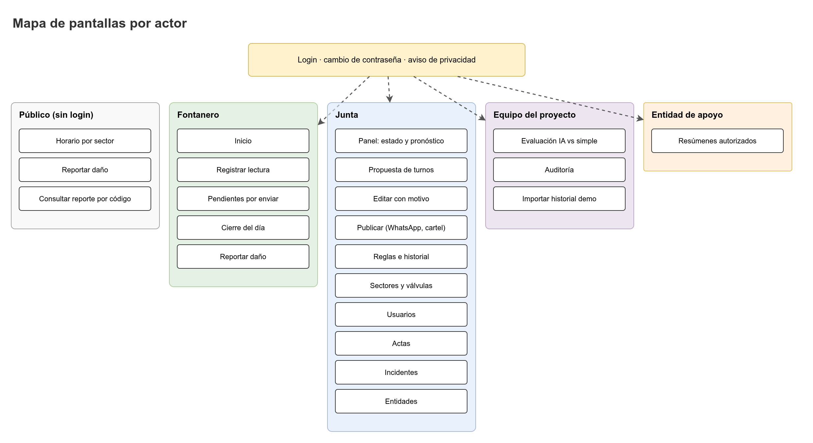

# Inventario de pantallas

Este documento lista cada pantalla de `caudal-frontend` por actor, con su identificador, propósito, datos que muestra, acciones, estados (vacío, cargando, error, sin conexión) y un boceto en ASCII. Los bocetos muestran la jerarquía y el orden, no el diseño visual final (ese está en `design-theme.md`).



Nota sobre identificadores: `S01` a `S28` identifican pantallas; los patrones de diseño se citan como "patrón P13".

## 0. Reglas que aplican a todas las pantallas

- Una acción principal por pantalla. Es el botón de color de acción (`water-700`); las demás son secundarias.
- Todo dato del acueducto demo lleva el aviso transversal "Datos simulados" (ver sección 12).
- Los números se muestran con coma decimal (`2,1`). Las horas y fechas se muestran en `America/Bogota`.
- Cada pantalla que depende de la red tiene cuatro estados: vacío, cargando, error y sin conexión. Los estados se describen en cada ficha.
- La barra de estado de sincronización (`SyncStatusBar`) está visible en todas las pantallas autenticadas. Muestra "En línea", "Sin conexión" o "Enviando lecturas pendientes", con el número de pendientes.
- Los mensajes de error no muestran códigos internos. El código (`code`) se traduce con `ErrorCodeMapper` y `es.ts`.

## 1. Acceso

### S01 Inicio de sesión
- **Actores:** todos los usuarios autenticados.
- **Propósito:** entrar con usuario y contraseña. Para `BOARD_ADMIN` y `PROJECT_TEAM` pide el código TOTP si tienen MFA activo.
- **Muestra:** campos de usuario y contraseña; en el segundo paso, campo de código de 6 dígitos y enlace "Usar código de respaldo".
- **Acciones:** "Entrar" (principal); "Usar código de respaldo".
- **Estados:**
  - Vacío: campos sin texto, botón deshabilitado hasta completar ambos.
  - Cargando: botón con texto "Entrando..." y campos deshabilitados.
  - Error: "Usuario o contraseña incorrectos" (mensaje genérico, sin revelar si el usuario existe). Si hay bloqueo: "Demasiados intentos. Intenta de nuevo en {minutes} minutos."
  - Sin conexión: "Necesitas conexión para entrar. Si ya entraste en este celular, puedes registrar lecturas sin conexión." (ver `offline-sync.md`, sección 9).

```
+------------------------------------------+
|  CAUDAL                                  |
|  El cuaderno del acueducto, pero digital |
|                                          |
|  Usuario                                 |
|  [ nicolas.diaz               ]          |
|  Contraseña                              |
|  [ ************              ]          |
|                                          |
|  Usuario o contraseña incorrectos        |
|                                          |
|  [          Entrar          ]            |
+------------------------------------------+
```

### S02 Cambio de contraseña
- **Actores:** todos. Obligatorio en el primer ingreso y tras un restablecimiento.
- **Propósito:** cambiar la contraseña. Las reglas vienen de la política del backend.
- **Muestra:** contraseña actual, nueva, confirmación; lista de requisitos con su estado (cumplido o no).
- **Acciones:** "Guardar contraseña" (principal).
- **Estados:** error de historial ("No puedes repetir una de tus últimas {count} contraseñas"); error de contraseña común ("Esa contraseña es muy común"); sin conexión: deshabilitada con mensaje.

```
+------------------------------------------+
|  Cambia tu contraseña                    |
|  Debes hacerlo antes de continuar.       |
|                                          |
|  Contraseña actual                       |
|  [ ****************          ]           |
|  Nueva contraseña                        |
|  [ ****************          ]           |
|    [x] Entre 12 y 128 caracteres         |
|    [ ] No contiene tu usuario            |
|    [ ] No es una contraseña común        |
|  Repite la nueva contraseña              |
|  [ ****************          ]           |
|                                          |
|  [     Guardar contraseña     ]          |
+------------------------------------------+
```

### S03 Aviso de privacidad
- **Actores:** todos, en su primer ingreso y cada vez que cambie la versión del aviso.
- **Propósito:** mostrar el aviso vigente (Ley 1581 de 2012) y registrar la aceptación.
- **Muestra:** texto de `GET /privacy-notice/current` con su versión y fecha; casilla de aceptación.
- **Acciones:** "Aceptar y continuar" (principal) → `POST /privacy-notice/accept`. Sin aceptación no hay acceso al resto de la app.
- **Estados:** cargando (texto de carga); error (reintentar); sin conexión: el aviso guardado en caché se muestra, la aceptación queda en espera y se envía al volver la red (propuesta, verificar que la aceptación pendiente no desbloquee la app).

```
+------------------------------------------+
|  Aviso de privacidad (versión 3)         |
|                                          |
|  Qué datos guardamos, para qué y        |
|  por cuánto tiempo...                    |
|  [ texto con desplazamiento          ]   |
|                                          |
|  [x] He leído y acepto el aviso.         |
|                                          |
|  [     Aceptar y continuar    ]          |
+------------------------------------------+
```

## 2. Público (sin login)

Estas pantallas viven bajo `/p/:aqueductSlug`. Usan `PublicLayout`, sin barra de sesión.

### S04 Horario público
- **Actores:** cualquier persona, sin login.
- **Propósito:** ver el horario publicado por sector, sin nombres ni teléfonos.
- **Muestra:** fecha de la publicación ("Publicado el 10 oct, 7:15 a. m."); tabla o lista por sector con horas de inicio y fin; "Datos simulados" si el acueducto es demo.
- **Acciones:** "Reportar un daño" (secundaria, lleva a S05); "Consultar mi reporte" (lleva a S06).
- **Estados:**
  - Vacío: "Todavía no hay horario publicado para hoy."
  - Cargando: esqueleto de la lista.
  - Error: "No pudimos cargar el horario. Intenta de nuevo." con botón "Reintentar".
  - Sin conexión: se muestra la última versión guardada con el aviso "Este horario es de {fecha}. Sin conexión no podemos confirmar si cambió."

```
+------------------------------------------+
|  Guaitarilla - Horario de agua           |
|  Publicado el 10 oct, 7:15 a. m.         |
|  [ DATOS SIMULADOS ]                     |
|                                          |
|  Sector Alto                             |
|    6:00 a. m. a 2:00 p. m.               |
|  Sector Centro                           |
|    2:00 p. m. a 10:00 p. m.              |
|                                          |
|  [ Reportar un daño ]                    |
|  [ Consultar mi reporte ]                |
+------------------------------------------+
```

### S05 Reportar un daño (público)
- **Actores:** cualquier persona, sin login. Limitado por rate limit (3 por hora por IP) y honeypot.
- **Propósito:** avisar un daño (fuga, tubo roto, sin agua, agua sucia, falla de válvula, otro).
- **Muestra:** categoría (catálogo), descripción (10 a 500 caracteres), lugar de referencia (0 a 120), y un campo oculto para el honeypot. No pide nombre ni teléfono.
- **Acciones:** "Enviar reporte" (principal). Al enviar, muestra el código de seguimiento de 8 caracteres una sola vez, con el aviso "Guarda este código. Lo necesitarás para consultar el estado."
- **Estados:**
  - Vacío: campos sin texto; el botón se habilita al completar categoría y descripción.
  - Cargando: botón "Enviando..." y campos deshabilitados.
  - Error: "Escribe al menos 10 caracteres." (de `FieldLimits`); límite por IP: "Ya enviaste varios reportes. Intenta más tarde."
  - Sin conexión: el envío se bloquea con el mensaje "Sin conexión. Intenta cuando tengas señal." (los reportes públicos no se encolan: son de la comunidad y necesitan confirmación inmediata del código).

```
+------------------------------------------+
|  Reportar un daño                        |
|                                          |
|  ¿Qué pasa?                              |
|  ( ) Fuga    ( ) Tubo roto               |
|  ( ) Sin agua   ( ) Agua sucia           |
|  ( ) Falla de válvula   ( ) Otro         |
|                                          |
|  Describe el daño                        |
|  [                                  ]    |
|  0 de 500 caracteres                     |
|  ¿Dónde? (opcional)                      |
|  [ cerca de la escuela          ]        |
|                                          |
|  [          Enviar reporte       ]       |
+------------------------------------------+
```

### S06 Consultar reporte por código
- **Actores:** quien reportó, con el código.
- **Propósito:** ver el estado del reporte sin login.
- **Muestra:** código (8 caracteres, Crockford base32), estado en lenguaje claro y fecha de la última actualización.
- **Estados del reporte:** `REPORTED` = "Recibido"; `VERIFYING` = "En verificación"; `CONFIRMED` = "Confirmado por la Junta"; `RESOLVED` = "Resuelto"; `DISMISSED` = "Descartado".
- **Estados:** código no encontrado: "No encontramos un reporte con ese código. Revisa que esté bien escrito." (sin confirmar si existe otro dato).

```
+------------------------------------------+
|  Consultar mi reporte                    |
|  Código de seguimiento                   |
|  [ 7K2M9QAZ ]   [ Consultar ]            |
|                                          |
|  Estado: En verificación                 |
|  Última actualización: 9 oct, 3:40 p. m. |
+------------------------------------------+
```

## 3. Fontanero (`OPERATOR`)

Las pantallas de esta sección viven bajo `/operador`.

### S07 Inicio del fontanero
- **Actores:** `OPERATOR`.
- **Propósito:** saber qué hacer hoy: turno publicado, lecturas pendientes y cierre del día.
- **Muestra:** turnos de hoy de la propuesta publicada; última lectura del tanque ("Último nivel 2,3 m, hace 6 h"); contador de pendientes.
- **Acciones:** "Registrar lectura" (principal, lleva a S08); "Ver pendientes (3)" (S09); "Cerrar el día" (S10, aparece después de la hora de cierre configurada); "Reportar un daño" (S11).
- **Estados:**
  - Vacío: "No hay turnos publicados para hoy. La Junta aún no publica el horario." y se muestra la última lectura.
  - Cargando: esqueleto.
  - Error: "No pudimos cargar el día. Lo que ya guardaste en este celular sigue disponible."
  - Sin conexión: se usan los datos guardados en Dexie con la marca "Dato de hace {hours} h" y la acción principal sigue activa.

```
+------------------------------------------+
|  Hoy, sábado 10 de octubre               |
|  SyncStatusBar: Sin conexión - 2 pend.   |
|                                          |
|  Último nivel del tanque                 |
|  2,3 m  -  hace 6 h  -  bajando          |
|                                          |
|  Turnos de hoy                           |
|  Sector Alto    6:00 a. m. - 2:00 p. m.  |
|  Sector Centro  2:00 p. m. - 10:00 p. m. |
|                                          |
|  [        Registrar lectura      ]       |
|  [ Pendientes (2) ]  [ Reportar daño ]   |
+------------------------------------------+
```

### S08 Registrar lectura
- **Actores:** `OPERATOR` y `BOARD_ADMIN` (la matriz de permisos de la sección 9 de los hechos da "Registrar lecturas" a ambos; `BOARD_MEMBER` no). Ver `architecture.md`, sección 4.1.
- **Propósito:** anotar el número de la regla pintada en el tanque, cómo se ve el agua y si hay daño. Funciona sin señal.
- **Muestra:**
  - Campo "Número de la regla pintada en el tanque" con teclado decimal, coma decimal aceptada y ayuda "Escribe un número entre 0 y 5" (leído de la regla vigente).
  - Fecha y hora de la lectura (por defecto, ahora; editable hasta 5 minutos atrás).
  - Aspecto del agua: dos opciones grandes "Agua normal" y "Agua con barro".
  - "¿Notaste algún daño?" con un interruptor. Si se activa, aparece la categoría (catálogo) y la nota.
  - Nota opcional (0 a 500 caracteres, hasta 10 líneas).
- **Acciones:** "Guardar lectura" (principal). Guarda en la cola offline aunque haya señal, y la envía en segundo plano. Muestra "Guardada. Se enviará ahora." o "Guardada en este celular. Se enviará al volver la red."
- **Estados:**
  - Vacío: campo vacío; el botón se habilita con un número válido.
  - Cargando: "Cargando reglas..." mientras no hay esquema (solo en el primer uso sin caché).
  - Error de validación: "El número no puede ser mayor que 5. Revisa el tanque y escribe de nuevo." (validación del cliente antes de enviar). Si el servidor responde `422 GAUGE_OUT_OF_RANGE`, la lectura no se guarda y aparece en S09 como "No se pudo enviar".
  - Sin conexión: el formulario funciona completo; el aviso dice "Sin conexión. La lectura se guarda en este celular."

```
+------------------------------------------+
|  Registrar lectura          Sin conexión |
|                                          |
|  Número de la regla pintada              |
|  [ 2,3               ]                   |
|  Escribe un número entre 0 y 5           |
|                                          |
|  Fecha y hora                            |
|  [ 10 oct, 2:15 p. m. ]  (puedes         |
|                           corregirla)    |
|                                          |
|  ¿Cómo se ve el agua?                    |
|  [  Agua normal  ] [ Agua con barro ]    |
|                                          |
|  ¿Notaste algún daño?        ( o )       |
|  Nota (opcional)                         |
|  [                                  ]    |
|                                          |
|  [          Guardar lectura      ]       |
+------------------------------------------+
```

Detalles de diseño del formulario:

- `inputMode="decimal"` en el campo; el valor se escribe como texto y se convierte con `FormSchemaBuilder.decimal` (acepta `2,1` y `2.1`).
- Los botones de aspecto del agua son un grupo de radio con etiqueta visible; no son solo iconos.
- Después de guardar, el formulario se limpia y deja el foco en el campo de la regla para la siguiente lectura.

### S09 Pendientes por enviar
- **Actores:** `OPERATOR`.
- **Propósito:** ver lo que está en el celular sin enviar y lo que el servidor pidió corregir o rechazó.
- **Muestra:** lista de elementos con: tipo ("Lectura del 10 oct, 2:15 p. m."), estado en lenguaje claro y motivo.
- **Estados por elemento:** "Pendiente" (aún no se envía), "Enviando", "Enviada" (sale de la lista tras confirmación), "No se pudo enviar" (`CORRECTION_PENDING`, con el motivo: "Este número está fuera de la regla del tanque, 0 a 4,5. Corrígelo para enviarlo."; "Descartar" con motivo obligatorio).
- **Acciones:** "Corregir" (en elementos `CORRECTION_PENDING`, abre S08 precargado con el motivo); "Descartar" (solo `CORRECTION_PENDING`, pide confirmación y motivo); "Enviar ahora" (principal si hay red).
- **Estados:**
  - Vacío: "No tienes lecturas pendientes. Todo está enviado."
  - Cargando: no aplica (los datos son locales).
  - Error: "No pudimos leer las pendientes de este celular. Recarga la página. Si sigue, avisa al equipo."
  - Sin conexión: la lista funciona; "Enviar ahora" se deshabilita con "Esperando señal".

```
+------------------------------------------+
|  Pendientes                              |
|  Sin conexión. 3 lecturas en el celular. |
|                                          |
|  Lectura 10 oct, 2:15 p. m.   Pendiente  |
|  Lectura 10 oct, 9:00 a. m.   Revisar    |
|     La regla cambió. Rango nuevo 0 a 4,5 |
|     [ Corregir ]                         |
|  Lectura 9 oct, 6:40 p. m.   No enviada  |
|     Motivo: fecha no válida              |
|     [ Descartar ]                        |
|                                          |
|  [         Enviar ahora       ]          |
+------------------------------------------+
```

### S10 Cierre del día
- **Actores:** `OPERATOR` y `BOARD_ADMIN` (la matriz da "Registrar lecturas y cierre del día" a ambos). `OPERATOR` solo cierra sus propios turnos.
- **Propósito:** anotar qué turnos se cumplieron, cuáles a medias y cuáles no, con novedades.
- **Muestra:** turnos publicados para la fecha, cada uno con: "Cumplido", "A medias" o "No cumplido" (`COMPLETED`, `PARTIAL`, `NOT_EXECUTED`); nota por turno (0 a 500 caracteres); nota general del día (`day_closure.notes`).
- **Acciones:** "Guardar cierre" (principal). Una vez guardado, "Corregir" crea una ejecución nueva que reemplaza a la anterior (`supersedes_id`); nunca se edita el original.
- **Estados:**
  - Vacío: "No hay turnos publicados para esta fecha."
  - Cargando: esqueleto de la lista de turnos.
  - Error: mensaje y "Reintentar".
  - Sin conexión: se registra en la cola (`CloseDayCommand`) con la marca "Cierre pendiente de envío".

```
+------------------------------------------+
|  Cierre del día - 10 oct                 |
|                                          |
|  Sector Alto  6:00 a. m. - 2:00 p. m.    |
|   ( ) Cumplido  (o) A medias  ( ) No     |
|   Nota: se cortó 1 hora por lluvia       |
|                                          |
|  Sector Centro 2:00 p. m. - 10:00 p. m.  |
|   (o) Cumplido  ( ) A medias  ( ) No     |
|                                          |
|  Novedades del día (opcional)            |
|  [                                  ]    |
|                                          |
|  [          Guardar cierre     ]         |
+------------------------------------------+
```

### S11 Reportar un daño (fontanero)
- **Actores:** `OPERATOR`, `BOARD_ADMIN`, `BOARD_MEMBER`, `PROJECT_TEAM` (según la matriz, "Ver horario publicado / reportar daño").
- **Propósito:** registrar un daño visto en campo. Crea un incidente.
- **Muestra:** categoría, descripción (10 a 500), lugar, y fecha y hora.
- **Acciones:** "Guardar reporte" (principal).
- **Estados:** vacío y cargando como S05; sin conexión: se encola (`CreateIncidentCommand`, propuesta, verificar en el backlog de `offline-sync.md`).

## 4. Junta (`BOARD_ADMIN`, `BOARD_MEMBER`)

Las pantallas de esta sección viven bajo `/junta`. Las acciones de decisión dependen del permiso, no solo del rol.

### S12 Estado del tanque y pronóstico
- **Actores:** `OPERATOR`, `BOARD_ADMIN`, `BOARD_MEMBER`, `PROJECT_TEAM` (ruta `/tanque`).
- **Propósito:** ver cómo está el tanque y qué nivel se espera en 1 a 3 días, con su rango.
- **Muestra:**
  - Último nivel, hace cuántas horas se tomó y si viene bajando, subiendo o estable (`TrendStrategy`, con texto además de flecha).
  - Gráfica del pronóstico (ver `forecast-visualization.md`) con la historia y el rango probable.
  - Texto de resumen: "Lo más probable es 2,1 m en 2 días, pero podría estar entre 1,8 m y 2,4 m."
  - Aviso de respaldo cuando la IA no respondió: "La IA no respondió. Usamos una estimación simple: se espera que siga igual que hoy (2,3 m)."
  - Aviso de dato viejo cuando la última lectura supera el umbral: "El último dato tiene más de {hours} horas. Puede no reflejar el tanque de hoy."
  - Botón "Actualizar pronóstico" (limitado por rate limit: 10 por hora por acueducto).
- **Acciones:** "Actualizar pronóstico" (secundaria); "Registrar lectura" (principal para el fontanero; en la Junta, enlace secundario).
- **Estados:**
  - Vacío: "Aún no hay lecturas de este tanque."
  - Cargando: esqueleto de la gráfica.
  - Error de pronóstico: se muestra el estado sin pronóstico y "No pudimos calcular el pronóstico. Puedes seguir usando el estado actual."
  - Sin conexión: última lectura y último pronóstico guardados, con su fecha de cálculo.

```
+------------------------------------------+
|  Tanque principal                        |
|  Último nivel: 2,3 m                     |
|  Tomado hace 6 h  -  bajando             |
|                                          |
|  Pronóstico a 3 días        [Actualizar] |
|  ~~~~~~~ gráfica con banda ~~~~~~~       |
|                                          |
|  Lo más probable: 2,1 m en 2 días.       |
|  Podría estar entre 1,8 m y 2,4 m.       |
|                                          |
|  ! La IA no respondió. Estimación simple:|
|    se espera que siga igual que hoy.     |
+------------------------------------------+
```

### S13 Propuesta de turnos
- **Actores:** `BOARD_ADMIN`, `BOARD_MEMBER` (generar, aprobar, modificar, rechazar).
- **Propósito:** revisar la propuesta de turnos del día con sus explicaciones.
- **Muestra:**
  - Horas disponibles hoy y por qué (banda del tanque, reserva, ventana de operación).
  - Lista de turnos por sector: horas, orden y explicación en lenguaje claro, con su código de origen. Ejemplos: "Sector Alto lleva 38 horas sin servicio." (`HOURS_WITHOUT_SERVICE`); "Sector Escuela es prioritario." (`PRIORITY_SECTOR`); "Hoy hay 8 horas por la banda bajo." (`TANK_BAND`); "Se dejó la reserva de 1,0 m." (`RESERVE_GUARD`).
  - Rango del pronóstico que se usó (`FORECAST_RANGE`).
  - Estado de la propuesta: `PENDING_REVIEW`, `APPROVED`, `APPROVED_WITH_CHANGES`, `REJECTED`, `PUBLISHED`, `CLOSED`.
- **Acciones:** "Aprobar" (principal); "Modificar" (lleva a S14); "Rechazar" (pide motivo); "Generar nueva propuesta" (secundaria).
- **Estados:**
  - Vacío: "Todavía no hay propuesta para hoy. Genérala cuando el nivel del tanque esté actualizado." con botón "Generar propuesta".
  - Cargando: "Calculando la propuesta..."
  - Error: "No pudimos generar la propuesta. Revisa que las reglas estén activas."
  - Sin conexión: solo lectura, con "Las decisiones necesitan conexión".

```
+------------------------------------------+
|  Propuesta de hoy - Pendiente de revisión|
|  Horas disponibles: 16 (banda alta)      |
|                                          |
|  Sector Escuela    6:00 - 9:00          |
|    Es prioritario (sector de la escuela) |
|  Sector Alto       9:00 - 17:00         |
|    Lleva 38 horas sin servicio           |
|  Sector Centro     17:00 - 21:00        |
|    Lleva 14 horas sin servicio           |
|                                          |
|  [ Aprobar ]  [ Modificar ] [ Rechazar ] |
+------------------------------------------+
```

### S14 Editar propuesta con motivo
- **Actores:** `BOARD_ADMIN`, `BOARD_MEMBER`.
- **Propósito:** cambiar horas o el orden de la propuesta. Cada cambio exige un motivo.
- **Muestra:** lista de sectores con control de horas (Radix Slider y campo numérico con los mismos valores); total de horas y horas disponibles; motivo (10 a 500 caracteres); propuesta original en la columna de referencia ("Original: 6 h").
- **Acciones:** "Guardar cambios" (principal, deshabilitada hasta que el mediador (patrón P15) dé `canSubmit`); "Cancelar".
- **Errores visibles:** "El total supera las horas disponibles (16)." ; "Un turno no puede durar menos de {min} horas." ; "Escribe el motivo del cambio (mínimo 10 caracteres)."
- **Estados:** cargando al guardar; error del servidor en línea; sin conexión: deshabilitada con mensaje.

```
+------------------------------------------+
|  Modificar propuesta de hoy              |
|  Total: 15 de 16 horas disponibles       |
|                                          |
|  Sector Alto     [-] 8 h [+]  Original 8 |
|  Sector Centro   [-] 7 h [+]  Original 8 |
|                                          |
|  Motivo del cambio (obligatorio)         |
|  [ Se pidió dejar 1 h más al Centro ]    |
|  30 de 500 caracteres                    |
|                                          |
|  [ Guardar cambios ]   [ Cancelar ]      |
+------------------------------------------+
```

### S15 Publicar horario
- **Actores:** `BOARD_ADMIN`, `BOARD_MEMBER`. Ver horario: también `OPERATOR`, `PROJECT_TEAM`.
- **Propósito:** publicar el horario aprobado y compartirlo sin login.
- **Muestra:** horario aprobado; estado "Publicado" con fecha; enlace a la página pública (S04).
- **Acciones:**
  - "Publicar horario" (principal, solo con propuesta aprobada). Sin aprobación no se publica (regla de los hechos canónicos).
  - "Copiar mensaje para WhatsApp": copia el texto de `GET /public/{slug}/schedule/whatsapp-text` al portapapeles y muestra "Mensaje copiado. Pégalo en el grupo." Si el portapapeles no está disponible, muestra el texto para seleccionar.
  - "Descargar cartel (PDF)": `GET /public/{slug}/schedule/poster.pdf`.
  - "Ver página pública" (abre S04 en nueva pestaña).
- **Estados:**
  - Vacío: "No hay horario aprobado para publicar."
  - Cargando: en la acción, el botón muestra "Publicando...".
  - Error: "No se publicó. Intenta de nuevo. El horario anterior sigue visible."
  - Sin conexión: los botones de WhatsApp y cartel se deshabilitan; se explica por qué.
- **Aviso de datos simulados:** el texto de WhatsApp y el cartel llevan la marca "Datos simulados" si el acueducto es demo.

```
+------------------------------------------+
|  Publicar horario - 10 oct               |
|  Estado: Aprobado. Aún no publicado.     |
|                                          |
|  [        Publicar horario       ]       |
|                                          |
|  Para compartir                          |
|  [ Copiar mensaje para WhatsApp ]        |
|  [ Descargar cartel (PDF)       ]        |
|  [ Ver página pública           ]        |
+------------------------------------------+
```

### S16 Reglas: editar borrador
- **Actores:** `BOARD_ADMIN` (editar y activar); `BOARD_MEMBER` (crear y editar un borrador).
- **Propósito:** cambiar los parámetros de la Junta en un borrador. Un borrador se crea copiando la versión vigente (`POST /rule-sets`).
- **Muestra:** rango del tanque; bandas (`HIGH`, `LOW`, `CRITICAL`) con su límite inferior, superior, horas de servicio y si son solo prioritarios; reserva; horario de operación; máximos por turno y por día ("Máximo {max}" leído del borrador); sectores prioritarios; orden de válvulas; antigüedad máxima de un dato; umbral de tendencia.
- **Acciones:** "Guardar borrador" (secundaria, solo si cambió); "Activar esta versión" (principal, solo `BOARD_ADMIN`, abre un diálogo que pide motivo de 10 a 500 caracteres); "Ver historial" (lleva a S17).
- **Estados:**
  - Vacío: no hay borrador: "No hay un borrador abierto. Crea uno a partir de la versión vigente." con "Crear borrador".
  - Cargando: esqueleto de la tabla de bandas.
  - Error de validación: las bandas no pueden solaparse ni dejar huecos; el mensaje indica el punto ("Entre 3,5 y 3,6 no hay banda").
  - Sin conexión: solo lectura.

```
+------------------------------------------+
|  Borrador v7 (basado en v6 vigente)      |
|                                          |
|  Rango del tanque: 0 a 5                 |
|  Bandas                                  |
|  Alta     3,5 a 5     16 h              |
|  Baja     1,5 a 3,5    8 h              |
|  Crítica  0 a 1,5      3 h  solo         |
|                          prioritarios    |
|  Reserva mínima: 1,0                     |
|  Máximo por turno: 8 h                   |
|                                          |
|  [ Guardar borrador ]  [ Activar... ]    |
|  [ Ver historial ]                       |
+------------------------------------------+
```

### S17 Reglas: historial de versiones y diferencias
- **Actores:** `BOARD_ADMIN`, `BOARD_MEMBER` (ver).
- **Propósito:** saber qué reglas estaban vigentes en cada momento y qué cambió entre dos versiones.
- **Muestra:** lista de versiones (número, fecha de activación, quién la activó, motivo); al elegir dos versiones, una tabla de diferencias con "antes" y "después" en texto (no solo color).
- **Acciones:** "Comparar" (elige dos versiones); "Ver esta versión" (solo lectura).
- **Estados:**
  - Vacío: "Todavía no hay versiones activas."
  - Cargando: esqueleto.
  - Error: reintentar.
  - Sin conexión: la lista guardada en caché, con la fecha de la última consulta.

```
+------------------------------------------+
|  Historial de reglas                     |
|  v6  activa desde 1 oct  (motivo: ...)   |
|  v5  hasta 30 sep                        |
|                                          |
|  Comparar: [ v5 ] con [ v6 ]             |
|  Parámetro         Antes     Después     |
|  Máximo por turno  8 h       7 h         |
|  Reserva           1,0       1,2         |
+------------------------------------------+
```

### S18 Sectores y válvulas
- **Actores:** `BOARD_ADMIN` (propuesta: quién edita la red queda "por definir", la matriz de la sección 9 no lo fija).
- **Propósito:** ver y ordenar sectores y válvulas que forman la red.
- **Muestra:** sectores con su prioridad; válvulas de cada sector con su código (`A1`, `B-2`); orden de apertura.
- **Acciones:** "Agregar sector"; "Agregar válvula"; "Subir" y "Bajar" para cambiar el orden (alternativa accesible al arrastre); "Editar nombre".
- **Estados:**
  - Vacío: "Aún no hay sectores. Agrega el primero."
  - Cargando: esqueleto.
  - Error: mensaje por campo (nombre de 2 a 60 caracteres, código de válvula de 1 a 20 caracteres en mayúsculas).
  - Sin conexión: solo lectura.

```
+------------------------------------------+
|  Sectores y válvulas                     |
|  1. Sector Escuela (prioritario)         |
|     V1 Válvula escuela      [Subir][Bajar]|
|  2. Sector Alto                          |
|     V2 Válvula alta         [Subir][Bajar]|
|     V3 Válvula alta-2       [Subir][Bajar]|
|  [ Agregar sector ] [ Agregar válvula ]  |
+------------------------------------------+
```

### S19 Usuarios y membresías
- **Actores:** `BOARD_ADMIN` (solo).
- **Propósito:** crear usuarios, asignar rol en el acueducto, activar o desactivar, y restablecer contraseñas.
- **Muestra:** usuarios con nombre, usuario (minúsculas), rol, estado y si el cambio de contraseña está pendiente. Nunca se muestra la contraseña ni el hash.
- **Acciones:** "Crear usuario" (usuario de 3 a 32 caracteres, nombre de 2 a 80, rol); "Cambiar rol" y "Desactivar" (ambos incrementan `token_version` en el backend, y la UI avisa "El usuario tendrá que volver a entrar"); "Restablecer contraseña" (crea una concesión con código de un solo uso).
- **Estados:**
  - Vacío: "Aún no hay usuarios. Crea el primero."
  - Cargando: esqueleto.
  - Error: "No se pudo guardar. El usuario ya existe o hay un dato no válido." (sin revelar si el usuario existe fuera de la Junta; en esta pantalla es información de administración).
  - Sin conexión: solo lectura.

```
+------------------------------------------+
|  Usuarios                 [Crear usuario]|
|  Nombre         Usuario     Rol      Est.|
|  Nicolas Diaz   ndiaz       Operador  Act.|
|     [Cambiar rol] [Restablecer clave]   |
|  Ana Pérez      aperez      Junta     Act.|
+------------------------------------------+
```

### S20 Actas
- **Actores:** `BOARD_ADMIN`, `BOARD_MEMBER` (generar).
- **Propósito:** generar un acta del periodo separando cuatro tipos de información: observado, estimado, inferido y confirmado.
- **Muestra:** lista de actas (periodo, fecha, estado); al abrir una, las secciones con su etiqueta: "Observado", "Estimado", "Inferido", "Confirmado".
- **Acciones:** "Generar acta" (principal: elige periodo); "Descargar PDF" (`GET /minutes/{id}/pdf`).
- **Estados:**
  - Vacío: "Todavía no hay actas. Genera la primera cuando la necesites."
  - Cargando: "Generando el acta. Puede tardar unos segundos."
  - Error: "No se pudo generar el acta. Intenta de nuevo."
  - Sin conexión: se pueden ver las actas en caché; generar y descargar se deshabilitan.
- **Aviso:** el PDF lleva "Datos simulados" si el acueducto es demo.

```
+------------------------------------------+
|  Actas                    [Generar acta] |
|  Acta 1-7 oct           Lista   [PDF]    |
|                                          |
|  Observado   Lecturas: 14 (7 al 9 oct)   |
|  Estimado    Horas disponibles: 16       |
|  Inferido    Posible fuga en Sector Alto |
|  Confirmado  Válvula V2 revisada en campo|
+------------------------------------------+
```

### S21 Incidentes y reportes de daño
- **Actores:** `BOARD_ADMIN`, `BOARD_MEMBER`, `OPERATOR` (crear), `PROJECT_TEAM` (ver).
- **Propósito:** ver los reportes de daño (públicos y del fontanero) y cambiar su estado con la historia.
- **Muestra:** lista con categoría, lugar, estado y fecha; detalle con historial de estados.
- **Estados del reporte:** `REPORTED` (Recibido), `VERIFYING` (En verificación), `CONFIRMED` (Confirmado), `RESOLVED` (Resuelto), `DISMISSED` (Descartado). El paso de `VERIFYING` o `DISMISSED` pide motivo.
- **Acciones:** "Verificar" (cambia a `VERIFYING`); "Confirmar" (cambia a `CONFIRMED`, y el aviso puede aparecer en el horario público); "Resolver"; "Descartar" (motivo obligatorio).
- **Estados de la pantalla:**
  - Vacío: "No hay reportes abiertos."
  - Cargando: esqueleto.
  - Error: reintentar.
  - Sin conexión: solo lectura con la última lista guardada.

```
+------------------------------------------+
|  Reportes de daño                        |
|  Fuga - Sector Alto      En verificación |
|  Sin agua - Sector Centro  Recibido      |
|  [ Confirmar ] [ Resolver ] [ Descartar ]|
+------------------------------------------+
```

### S22 Entidades: autorizar resúmenes
- **Actores:** `BOARD_ADMIN` (autoriza); `BOARD_MEMBER` (ve lo autorizado).
- **Propósito:** decidir qué resumen ve una entidad de apoyo y hasta cuándo.
- **Muestra:** entidades autorizadas con el resumen (acta o periodo), fecha de inicio y de fin; estado "Vigente" o "Vencida".
- **Acciones:** "Autorizar resumen" (elige resumen y fecha de fin, `POST /summary-shares`); "Revocar" (`DELETE /summary-shares/{id}`, pide confirmación).
- **Estados:**
  - Vacío: "Ninguna entidad tiene un resumen autorizado."
  - Cargando: esqueleto.
  - Error: reintentar.
  - Sin conexión: solo lectura.

```
+------------------------------------------+
|  Entidades de apoyo                      |
|  Entidad A   Acta 1-7 oct   Vigente      |
|              hasta 31 oct   [ Revocar ]  |
|  [ Autorizar resumen ]                   |
+------------------------------------------+
```

## 5. Equipo del proyecto (`PROJECT_TEAM`)

Estas pantallas viven bajo `/equipo`. El equipo ve el estado del tanque (S12) y el horario publicado (S15, solo lectura).

### S23 Evaluación IA vs estimación simple
- **Actores:** `PROJECT_TEAM` (ver). `BOARD_ADMIN` lo ve en su panel de salud (S24).
- **Propósito:** saber si la IA ayuda de verdad frente a la estimación simple, con el criterio documentado.
- **Muestra:**
  - Pronósticos evaluados: "12 de 30 necesarios para decidir".
  - Por horizonte (1, 2 y 3 días): error medio del p50 (MAE) de la IA y de la estimación simple; mejora (skill = 1 − MAE_IA / MAE_simple); cobertura del rango [p10, p90] (meta ≈ 80 %); ancho del rango.
  - Pérdida cuantílica ponderada (WQL) como fila aparte.
  - Veredicto con su criterio: "La IA ayuda: mejora sostenida con 30 o más pronósticos y cobertura entre 70 % y 90 %."
- **Acciones:** "Ver detalle por día" (tabla); "Exportar" (por definir).
- **Estados:**
  - Vacío: "Todavía no hay pronósticos evaluados. Se evalúan cuando llegan los datos reales."
  - Cargando: esqueleto de la tabla.
  - Error: reintentar.
  - Sin conexión: última evaluación guardada, con la fecha.
- **Aviso:** "Datos simulados" en todo el panel.

```
+------------------------------------------+
|  IA vs estimación simple  Datos simulados|
|  Evaluados: 12 de 30 necesarios          |
|                                          |
|  Horizonte  MAE IA  MAE simple  Mejora   |
|  1 día      0,12    0,15        20 %     |
|  2 días     0,21    0,19       -10 %     |
|  3 días     0,30    0,28       -7 %      |
|  Cobertura del rango: 76 %   (meta 80 %) |
|                                          |
|  Veredicto: aún no hay evidencia         |
+------------------------------------------+
```

Los valores son de muestra del boceto, no datos reales.

### S24 Salud técnica
- **Actores:** `PROJECT_TEAM`, `BOARD_ADMIN`.
- **Propósito:** ver el estado de los servicios: IA, circuito de protección, cola de sincronización de dispositivos y última telemetría.
- **Muestra:** estado de la IA (`/v1/ready` vía la API): "Lista", "No lista" o "Sin respuesta"; estado del circuito (`Cerrado`, `Abierto`, `Semiabierto`) con su explicación; hora de la última telemetría por dispositivo.
- **Acciones:** "Actualizar" (secundaria).
- **Estados:**
  - Vacío: "No hay dispositivos registrados. Son opcionales en la versión sin hardware."
  - Cargando: esqueleto.
  - Error: "No se pudo consultar la salud del sistema."
  - Sin conexión: último estado guardado con su hora.

```
+------------------------------------------+
|  Salud técnica                           |
|  IA del pronóstico      Lista            |
|  Protección de la IA    Cerrado          |
|     (las respuestas llegan con normalidad)|
|  Última telemetría      hace 3 min       |
+------------------------------------------+
```

### S25 Dispositivos
- **Actores:** `PROJECT_TEAM` y `BOARD_ADMIN` (registrar y rotar claves). El comando manual de válvula es solo de `BOARD_ADMIN`, con motivo.
- **Propósito:** registrar dispositivos, ver su telemetría y rotar la clave pública.
- **Muestra:** dispositivos con identificador, último mensaje, batería, estado de la válvula; no se muestra la clave privada (nunca existe en el backend).
- **Acciones:** "Registrar dispositivo"; "Rotar clave"; "Comando manual de válvula" (solo `BOARD_ADMIN`, pide motivo de 10 a 500 caracteres).
- **Estados:**
  - Vacío: "No hay dispositivos. Regístralo cuando tengas uno."
  - Cargando: esqueleto.
  - Error: reintentar.
  - Sin conexión: solo lectura.

```
+------------------------------------------+
|  Dispositivos                 Datos simul.|
|  caudal-sim-01    hace 3 min   Bat. 84 %  |
|  Válvula V2: Abierta                     |
|  [ Registrar dispositivo ] [ Rotar clave ]|
+------------------------------------------+
```

### S26 Auditoría
- **Actores:** `PROJECT_TEAM`, `BOARD_ADMIN`. Solo lectura.
- **Propósito:** ver quién hizo qué y cuándo, y los eventos de seguridad.
- **Muestra:** tabla con fecha (zona `America/Bogota`), usuario, acción, objeto y resultado; pestaña de eventos de seguridad (`GET /security-events`). Sin datos personales completos: la IP aparece como su HMAC.
- **Acciones:** filtrar por fecha, usuario y acción; "Exportar CSV" (con protección contra inyección de fórmulas).
- **Estados:**
  - Vacío: "No hay eventos con esos filtros."
  - Cargando: esqueleto de la tabla.
  - Error: reintentar.
  - Sin conexión: no disponible (se muestra el mensaje y no hay caché de auditoría).

```
+------------------------------------------+
|  Auditoría                               |
|  Desde [1 oct] Hasta [9 oct] Acción [v]  |
|  Fecha         Usuario   Acción   Resul.  |
|  9 oct 3:40 pm ndiaz     LOGIN    OK     |
|  9 oct 3:12 pm aperez    RULE_ACT FAIL   |
|  [ Exportar CSV ]                        |
+------------------------------------------+
```

### S27 Importar historial (solo acueducto demo)
- **Actores:** `PROJECT_TEAM` (solo acueducto demo).
- **Propósito:** cargar historial simulado de lecturas, turnos e incidentes (`POST /imports/readings`, `/imports/shift-executions`, `/imports/incidents`).
- **Muestra:** selección de tipo de importación; archivo (formato por definir, verificar en OpenAPI); resumen tras el envío: aceptadas, marcadas, rechazadas y motivo por fila.
- **Acciones:** "Importar" (principal); "Descargar reporte de filas rechazadas".
- **Estados:**
  - Vacío: "Elige un archivo para importar."
  - Cargando: barra de progreso por lote (máximo 5.000 filas por lote).
  - Error: "El archivo no se pudo leer. Revisa el formato."
  - Sin conexión: deshabilitada.
- **Aviso:** solo aparece si el acueducto es demo; en otro caso la ruta responde 404.

```
+------------------------------------------+
|  Importar historial         Datos simul. |
|  Tipo: [ Lecturas v ]                    |
|  Archivo: [ historial.csv ]              |
|  [ Importar ]                            |
|                                          |
|  Resultado: 1.240 aceptadas, 3 marcadas, |
|  2 rechazadas   [ Descargar rechazadas ] |
+------------------------------------------+
```

## 6. Entidad de apoyo (`SUPPORT_ENTITY`)

### S28 Resúmenes autorizados
- **Actores:** `SUPPORT_ENTITY`.
- **Propósito:** ver solo los resúmenes que la Junta autorizó y que siguen vigentes.
- **Muestra:** lista de resúmenes con título, periodo y fecha de vencimiento; enlace de descarga del PDF.
- **Acciones:** "Ver resumen"; "Descargar PDF".
- **Estados:**
  - Vacío: "La Junta aún no ha compartido resúmenes con su entidad."
  - Cargando: esqueleto.
  - Error: "No pudimos cargar los resúmenes. Intenta de nuevo."
  - Sin conexión: la lista de la última consulta, con la fecha. Un resumen vencido no se muestra aunque esté guardado.
- **Vencido:** "Autorización vencida el {date}. Pide a la Junta una nueva."

```
+------------------------------------------+
|  Resúmenes de la Junta                   |
|  Resumen 1-7 oct          Vigente hasta  |
|                           31 oct         |
|  [ Ver resumen ]  [ Descargar PDF ]      |
+------------------------------------------+
```

## 7. Aviso transversal: "Datos simulados"

No es una pantalla. Es un componente (`SimulatedDataBanner`) que aparece en todas las pantallas que muestran datos de un acueducto demo: S04, S12, S13, S15, S20, S23, S25, S27 y los PDF generados.

```
+------------------------------------------+
|  DATOS SIMULADOS                         |
|  Estos números vienen de una simulación. |
|  No corresponden a mediciones reales.    |
+------------------------------------------+
```

Reglas:

- El texto "Datos simulados" está en `es.ts` (`simulated.banner`). Es un banner de texto, no un icono solo.
- Contraste AA sobre el fondo, con el icono de `lucide-react` como apoyo visual.
- No se oculta con scroll ni se cierra con un botón: aparece mientras el dato sea demo.

## 8. Mapa rápido por actor

| Actor | Pantallas |
|-------|-----------|
| Público | S04, S05, S06 |
| Sesión (todos) | S01, S02, S03 |
| `OPERATOR` | S07, S08, S09, S10, S11, S12, S15 (solo ver) |
| `BOARD_MEMBER` | S12, S13, S14, S15, S16 (crear y editar borrador), S17, S20, S21, S22 (ver) |
| `BOARD_ADMIN` | Todas de la Junta, más S08, S10, S19, S22 (autorizar) |
| `PROJECT_TEAM` | S12, S15 (ver), S23, S24, S25, S26, S27 (solo demo) |
| `SUPPORT_ENTITY` | S28 |

## 9. Estados transversales

| Estado | Dónde se ve | Texto (`es.ts`) |
|--------|-------------|-----------------|
| En línea | `SyncStatusBar` | `connection.online` |
| Sin conexión | `SyncStatusBar` y pantalla afectada | `connection.offline` |
| Enviando | `SyncStatusBar` | `connection.syncing` |
| Sesión vencida | Modal de S01 | `auth.sessionExpired` |
| Error genérico | Pie de la pantalla | `errors.generic` |
| Dato viejo | Encabezado del tanque | `tank.staleData` |

## 10. Accesibilidad y foco

- Cada pantalla tiene un único `h1`. Los subtítulos son `h2` y `h3` en orden.
- Al cambiar de pantalla, el foco va al `h1` (o al campo principal en el formulario de lectura).
- Los mensajes de estado de la barra de sincronización usan `aria-live="polite"`. Los errores de validación usan `aria-describedby`.
- Los botones de solo icono llevan `aria-label` desde `es.ts`.

## 11. Pendientes de diseño

- Nombre exacto del campo de permisos en `/auth/me` (verificar en OpenAPI).
- Quién puede editar la red (sectores y válvulas) (por definir con la Junta).
- Formato de archivo de importación (verificar).
- Si `BOARD_MEMBER` puede corregir lecturas de otros fontaneros (la matriz dice "Sí", el detalle queda por confirmar).

Relacionados: [`ux-guidelines.md`](ux-guidelines.md), [`design-theme.md`](design-theme.md), [`offline-sync.md`](offline-sync.md), [`forecast-visualization.md`](forecast-visualization.md)
