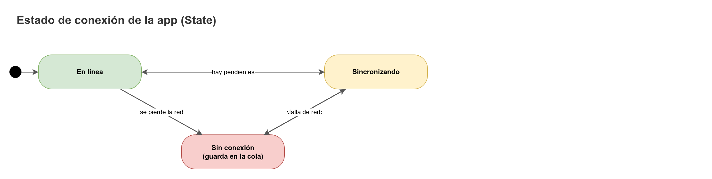

# Guía de UX para uso en campo

CAUDAL lo usan fontaneros en veredas de Guaitarilla con sol fuerte, celulares de gama baja, guantes o manos mojadas, y señal intermitente. Esta guía fija reglas concretas para que la app se pueda usar así. Cada regla es verificable: se prueba en pantalla, con un celular real o con las herramientas de `testing-plan.md`.

## 1. Contexto de uso

| Condición | Consecuencia de diseño |
|-----------|------------------------|
| Sol directo sobre la pantalla | Contraste alto (≥ 4,5:1 en texto), fondos claros y sin grises tenues. |
| Celular de gama baja (memoria y procesador limitados) | Pocas animaciones, sin sombras pesadas, imágenes livianas, listas paginadas. |
| Manos mojadas, con tierra o guantes | Objetivos táctiles grandes, espacio entre botones, confirmación para acciones de un toque. |
| Señal intermitente o nula | Guardar primero, enviar después. Siempre mostrar si el dato ya salió. |
| Lectura de pie, a la distancia de un brazo | Fuente base grande, números grandes para la lectura principal. |
| Persona con poca práctica en el celular | Una acción principal por pantalla, lenguaje cotidiano, sin menús anidados. |
| Usuarios mayores o con baja visión | Escalado de texto del sistema respetado, foco visible, contraste AA. |

## 2. Tamaños y objetivos

| Elemento | Mínimo | Nota |
|----------|--------|------|
| Objetivo táctil (botón, casilla, opción de radio) | 48 × 48 px | Vale también para el área tocable de un icono. |
| Separación entre objetivos táctiles | 8 px | Evita tocar el botón de al lado. |
| Fuente base en móvil | 18 px | Para cuerpo de texto y etiquetas de campo. |
| Fuente en tablas de datos | 16 px | Solo en la Junta, en pantalla grande; en móvil se usa lista, no tabla. |
| Número principal (lectura, nivel del tanque) | 40 px o más | Con `font-variant-numeric: tabular-nums`. |
| Alto de campo de texto | 52 px | Mayor para facilitar el toque y la escritura. |
| Ancho mínimo soportado | 360 px | Sin desplazamiento horizontal en ningún punto. |

Ver `design-theme.md` para los tokens que usan estas medidas.

## 3. Una acción principal por pantalla

- Cada pantalla tiene una sola acción principal (botón de color de acción). Es la que el usuario hace casi siempre: "Registrar lectura", "Guardar lectura", "Aprobar", "Publicar horario".
- Las demás acciones son secundarias (contorno o texto) y no compiten visualmente.
- La acción destructiva (descartar, revocar, desactivar) es un botón secundario con color de peligro, nunca el principal, y siempre pide confirmación.
- En el inicio del fontanero (S07), la lectura es la acción principal. Pendientes y reporte de daño son secundarias.

## 4. Lenguaje claro

Reglas de redacción para `es.ts`:

- Frases cortas, en orden de acción: qué pasó, qué hacer ahora.
- Cero jerga técnica en pantalla. Ejemplos:

| En lugar de | Usar |
|-------------|------|
| "Cuantil p10" o "intervalo de confianza" | "Podría estar entre 1,8 m y 2,4 m" |
| "Pronóstico con p50" | "Lo más probable es 2,1 m" |
| "Error de validación 422" | "No pudimos guardar esta lectura. Revisa el número." |
| "Rate limit excedido" | "Ya enviaste varios reportes. Intenta más tarde." |
| "Token expirado" | "Tu sesión venció. Entra de nuevo." |
| "Turno SUB-2 sin ejecutar" | "Turno del sector Alto no cumplido" |
| "MAE" o "skill" en la pantalla principal | Se explican en el detalle de S23, no en el encabezado |
| "Dato stale" | "El último dato tiene más de 12 horas." |

- Tratar a la persona con "tú" y verbos en imperativo cuando pide algo: "Escribe", "Revisa", "Entra".
- Una idea por frase. Evitar más de dos subordinadas.
- Los textos de error dicen qué hacer, no solo qué falló.

## 5. Números y fechas

- Decimal con coma: `2,1 m`, `1,5`. En la entrada, se aceptan coma y punto (ver `FormSchemaBuilder`), pero la pantalla muestra siempre coma.
- Miles con punto: `1.240 lecturas`. Solo cuando el número tiene cuatro cifras o más.
- Horas en formato de 12 horas con a. m. / p. m. en pantalla (la gente de la vereda lo usa así); en el JSON y en las pruebas, ISO-8601.
- Fechas en `America/Bogota`: `10 oct, 2:15 p. m.`. Sin año si es el año actual.
- Duraciones en lenguaje natural: "hace 6 h", "hace 2 días".
- Porcentajes sin decimales salvo que la diferencia lo requiera (`76 %` con espacio antes del signo, según la norma colombiana).

## 6. Confirmaciones

| Acción | ¿Confirma? | Texto de confirmación |
|--------|-----------|------------------------|
| Guardar lectura | No (se guarda y se muestra el resultado) | "Guardada. Se enviará ahora." |
| Aprobar propuesta | Sí, con resumen | "Aprobar el horario de hoy: {sectors} sectores, {hours} horas. ¿Aprobar?" |
| Publicar horario | Sí | "Al publicar, las familias verán este horario. ¿Publicar?" |
| Modificar o rechazar | Sí, con motivo obligatorio | "Escribe por qué cambias la propuesta (mínimo 10 caracteres)." |
| Activar versión de reglas | Sí, con motivo | "Esta versión regirá desde ahora. Escribe el motivo." |
| Descartar lectura pendiente | Sí, con motivo | "Esta lectura no se enviará. ¿Descartarla?" |
| Cerrar sesión con pendientes | Sí | Ver `offline-sync.md`, sección 8.3. |
| Revocar resumen de una entidad | Sí | "La entidad dejará de ver este resumen. ¿Revocar?" |

Reglas:

- El botón de confirmación repite el verbo de la acción ("Publicar", "Descartar"), no dice "Sí" o "Aceptar".
- El botón de cancelar siempre existe y es el foco inicial en acciones destructivas.
- Después de una acción exitosa, el aviso dice qué pasó: "Horario publicado. Las familias ya lo pueden ver."
- Los avisos (sonner) duran 5 s, no se cierran solos si contienen un error, y se pueden leer con lector de pantalla (`aria-live`).

## 7. Estados de sincronización

Siempre visibles en las pantallas autenticadas (`SyncStatusBar`):

| Estado | Icono (lucide) | Texto | Color (token) |
|--------|----------------|-------|---------------|
| En línea y al día | `Cloud` | "En línea" | `--color-paramo-800` |
| Sin conexión | `CloudOff` | "Sin conexión. Las lecturas se guardan aquí." | `--color-ochre-800` |
| Enviando | `RefreshCw` (animado si no hay reducción de movimiento) | "Enviando lecturas pendientes" | `--color-water-700` |
| Pendientes | Número en el texto | "Pendientes: 3" | El mismo del estado |
| Requiere atención | `AlertTriangle` | "2 lecturas necesitan revisión" | `--color-clay-700` |

Reglas:

- El estado nunca se comunica solo con color: siempre hay icono y texto.
- El contador de pendientes es el dato más importante: si el usuario cree que todo salió y no salió, pierde trabajo. Por eso se muestra en la barra y en el inicio.
- Cuando el envío termina, el aviso dice cuántas se enviaron: "3 lecturas enviadas."
- "Datos de hace N horas" aparece cuando el dato del tanque es viejo (ver S12).

## 8. Accesibilidad WCAG 2.1 AA

Cumplimiento mínimo obligatorio. Se verifica con `axe` en Playwright (ver `testing-plan.md`) y con revisión manual.

| Criterio | Regla de CAUDAL |
|----------|-----------------|
| 1.4.3 Contraste (texto) | ≥ 4,5:1 para texto normal; ≥ 3:1 para texto grande (≥ 24 px o ≥ 18,66 px en negrita). |
| 1.4.11 Contraste de componentes | ≥ 3:1 para bordes de controles, iconos significativos, foco y partes de gráficas que transmiten información. |
| 1.4.1 Uso del color | Ningún estado depende solo del color (icono y texto). |
| 1.4.4 Redimensionar texto | La app funciona al 200 % de tamaño de texto sin pérdida de contenido. |
| 1.4.10 Reflujo | Sin desplazamiento horizontal a 320 CSS px de ancho (aplica a 360 px como mínimo de diseño). |
| 2.1.1 Teclado | Todo es operable con teclado (Tab, Enter, Espacio, flechas en grupos). |
| 2.4.7 Foco visible | Anillo de foco de 3 px (`--color-focus`) con desplazamiento de 2 px. Nunca `outline: none` sin reemplazo. |
| 2.5.5 Tamaño del objetivo (AAA en WCAG 2.1, 44 px) | 48 px en toda la app, más exigente que el mínimo del criterio. |
| 3.3.1 Identificación de errores | El error se dice en texto y se asocia al campo con `aria-describedby`. |
| 3.3.2 Etiquetas | Todo campo tiene etiqueta visible. El placeholder nunca reemplaza la etiqueta. |
| 4.1.2 Nombre, función, valor | Radix da roles y estados; los botones de solo icono llevan `aria-label` desde `es.ts`. |
| 4.1.3 Mensajes de estado | Barra de sincronización y avisos con `role="status"` o `aria-live="polite"`. Errores graves con `role="alert"`. |

Detalles:

- Un `h1` por pantalla. Encabezados en orden.
- Orden de lectura y foco coincide con el visual.
- Las gráficas (ver `forecast-visualization.md`) tienen tabla alternativa.
- Los iconos decorativos llevan `aria-hidden="true"`.
- Idioma de la página: `<html lang="es">`.
- Movimiento reducido: se respeta `prefers-reduced-motion`; sin animaciones que dependan del movimiento para entender algo.

## 9. Formularios

- Una columna. Un campo por fila en móvil.
- La etiqueta va arriba del campo, siempre visible.
- El teclado correcto: `inputMode="decimal"` para números, `inputMode="numeric"` para códigos de dígitos, `autoComplete` para usuario y contraseña.
- Los errores aparecen al salir del campo o al enviar, nunca mientras se escribe (salvo el contador de caracteres).
- El botón de enviar no se deshabilita sin explicación: si está deshabilitado, hay un texto que dice por qué.
- Los contadores de caracteres muestran "30 de 500 caracteres" y avisan al pasar del 90 %.
- Al enviar con error, el foco va al primer campo con error.

## 10. Lectura de la gráfica y del pronóstico

- El resumen en texto va antes que la gráfica: "Lo más probable es 2,1 m en 2 días, pero podría estar entre 1,8 m y 2,4 m."
- La gráfica no es la única fuente de información (ver `forecast-visualization.md`).
- Los avisos de respaldo y de dato viejo aparecen encima de la gráfica, no dentro de ella.

## 11. Respuestas ante fallas

| Falla | Qué ve el usuario | Qué puede hacer |
|-------|-------------------|-----------------|
| Sin señal al guardar | "Guardada en este celular. Se enviará al volver la red." | Seguir registrando. |
| La IA no responde | "La IA no respondió. Usamos una estimación simple: se espera que siga igual que hoy." | Seguir usando el estado y la propuesta. |
| Error del servidor | "No pudimos completar la acción. Intenta de nuevo. Lo que ya guardaste sigue aquí." | Reintentar. |
| Sesión vencida | "Tu sesión venció. Entra de nuevo y enviamos tus lecturas pendientes." | Entrar. |
| Permiso denegado | "Tu cuenta no puede hacer esta acción. Pide ayuda a la Junta." | Volver al inicio. |
| Página no existe | "No encontramos esta página." | Volver al inicio. |

Reglas:

- **No bloquear por fallas de la IA.** El pronóstico tiene respaldo. La propuesta de turnos se puede revisar con la estimación simple. Ninguna acción del fontanero depende de la IA.
- Un mensaje de error siempre trae el código de la API traducido por `ErrorCodeMapper` (ver `architecture.md`, sección 10). El código técnico no se muestra al usuario; queda en el `request_id` para soporte, que se puede copiar.
- Los mensajes de error no culpan a la persona ("Escribiste mal" es mejor que "Entrada inválida").

## 12. Página pública

- La página pública la lee cualquier familia; sin login, sin nombres, sin teléfonos.
- Textos cortos. El horario primero, la fecha de publicación visible, y las acciones (reportar, consultar) después.
- Funciona con señal débil: carga el texto antes que las imágenes, y muestra la última versión guardada con su fecha.

## 13. Movimiento y respuesta visual

- Transiciones de 150 a 250 ms. Sin rebotes.
- No hay animación que tape el contenido mientras carga; se usan esqueletos estáticos o con movimiento suave.
- Respeta `prefers-reduced-motion: reduce`.

## 14. Lista de verificación antes de dar por terminada una pantalla

1. ¿Hay una sola acción principal visible?
2. ¿Todos los objetivos táctiles miden al menos 48 px?
3. ¿El texto principal es de 18 px o más en móvil?
4. ¿Los números usan coma decimal y tabular-nums?
5. ¿Existen los estados vacío, cargando, error y sin conexión?
6. ¿El estado de sincronización es visible y tiene texto?
7. ¿Los errores dicen qué hacer, sin jerga ni códigos?
8. ¿Las acciones destructivas piden motivo o confirmación?
9. ¿La pantalla funciona a 360 px sin desplazamiento horizontal?
10. ¿El contraste de todo el texto es de 4,5:1 o más?
11. ¿Se puede usar solo con teclado y el foco se ve?
12. ¿La pantalla cumple las reglas de `design-theme.md` (sin degradados, sin emojis, sin cards con borde izquierdo)?

Relacionados: [`screens.md`](screens.md), [`design-theme.md`](design-theme.md), [`offline-sync.md`](offline-sync.md), [`testing-plan.md`](testing-plan.md)
